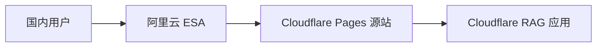
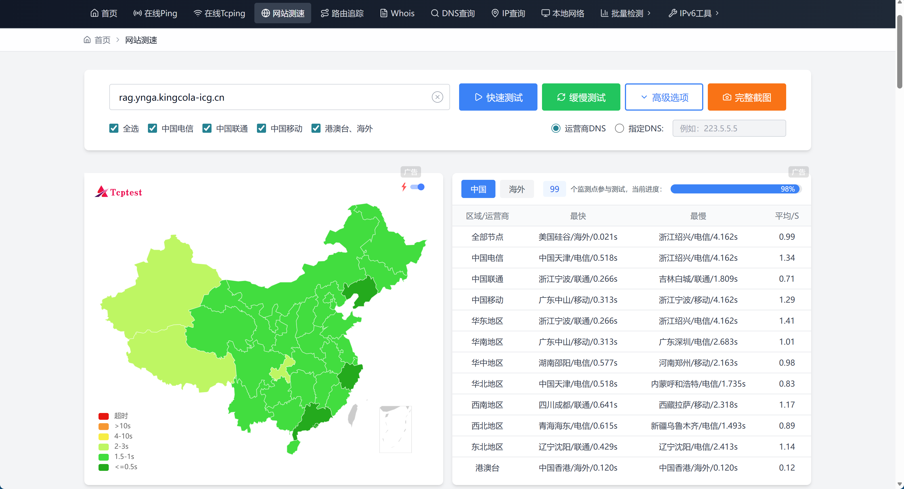
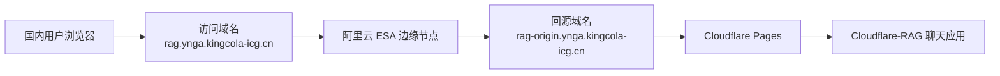
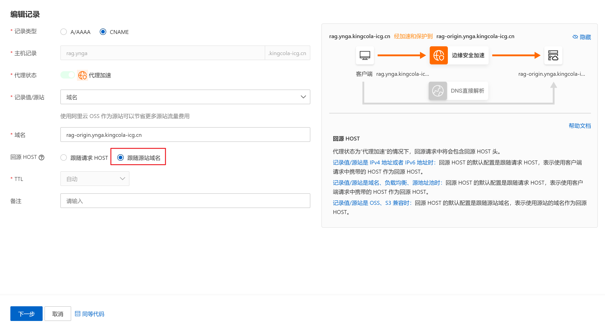
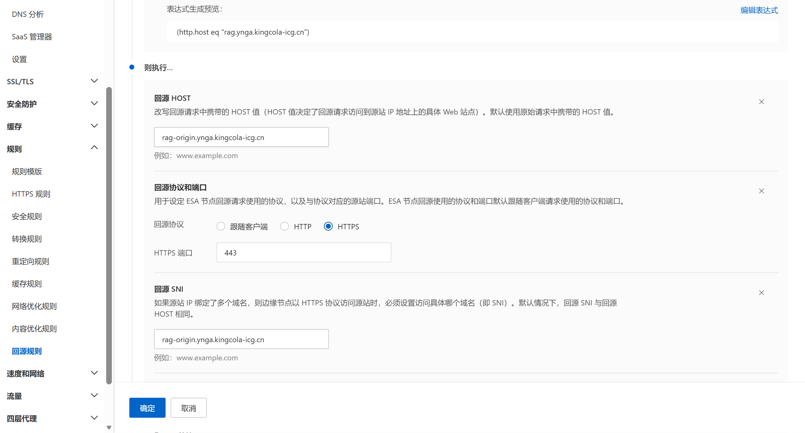
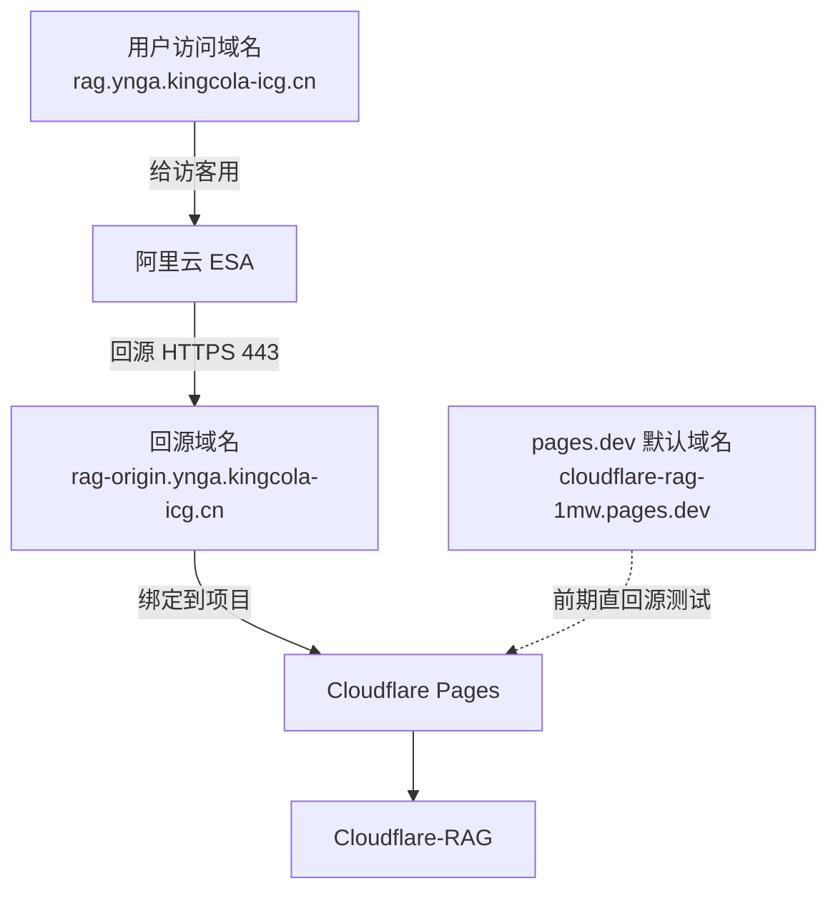

承接前文进一步接入这个博客里的 `Cloudflare-RAG` 聊天界面。

前面的知识库、嵌入认证、UI 这些事情，其实都已经能用了。  
真正让我继续往下抠的，反而是最朴素的问题。

国内访问还是慢。

这个慢不是说完全打不开。  
而是那种你点开以后，它会明显让你感觉到自己在等。

如果只是普通静态页，这种等待还没那么刺眼。  
但聊天页不一样，尤其是我这边还有内嵌 iframe、接口请求、流式回答这几层叠在一起。  
前面任意一层慢一点，体感都会被放大。

所以我后来做的事情其实挺直接，就是没去动核心后端，还是把 `Cloudflare-RAG` 放在 Cloudflare 上跑，然后在前面加了一层 **阿里云 ESA**。

换句话说，我现在这条链路不是把服务搬家了，而是把入口换了。



其实主要是我搜了一圈，看搜索提到的 `Cloudflare` 的国内加速，能搜到的大多还是优选域名那条路。

那条路不是不能走。  
只是对我现在这个场景来说，我没有特别想继续往那边折腾。

一方面，我自己的域名本来就在阿里云。  
另一方面，我对这个聊天页的要求也没有到一定要追求特别激进的国内访问速度。

我更在意的是另一件事：

- 不用再额外折腾一套优选域名方案
- 入口能比原来顺一点
- 国内访问至少是可用、稳定、正常能打开

从这个角度看，阿里云 ESA 免费版其实也算一条可选路径。  
它不是那种一开就会有特别明显提速的方案，有些时候体感还是会慢一点。  
但如果你的目标和我差不多，只是想把 `Cloudflare-RAG` 在国内的访问体验往前推一点，让它更容易正常使用，那它还是有价值的。

我自己用网站测速工具看了一下，结果大概就是这个感觉。



所以这篇文章更适合这样看。  
它不是在讲一个效果特别猛的国内加速方案，而是在讲一个相对省事、能改善一些体验、也比较符合我现在折腾成本预期的做法。

这篇就把这次阿里云 ESA 配置过程记一下。

顺手也把几个容易踩的坑一起写掉，免得后面再绕一圈。

::github{repo="RafalWilinski/cloudflare-rag"}

如果把我这几天围着 `Cloudflare-RAG` 写的几篇文章连起来看，这篇更偏后半段。  
前面两篇分别是：

- [用 Cloudflare-RAG 给我的博客补一个 AI 知识库](/posts/cloudflare-rag-mizuki-ai-kb/)，先讲为什么要接这套东西
- [把 Cloudflare-RAG 真正接进 Mizuki 博客](/posts/cloudflare-rag-mizuki-integration-detail/)，再讲同步、内嵌认证和具体实现

这一篇主要补的是，服务已经接好了以后，怎么继续把国内访问这一层往前推一下。

## 先把几个值记下来

一开始接入 ESA 的时候，我先把下面几个值固定下来了。

- 加速域名，`rag.ynga.kingcola-icg.cn`
- 根域名，`kingcola-icg.cn`
- ESA 回源源站，`cloudflare-rag-1mw.pages.dev`
- 阿里云 DNS 主机记录，`rag.ynga`

这里我自己的场景是这样的。

域名本身在阿里云。  
RAG 的核心服务部署在 Cloudflare Pages。  
然后我希望国内用户访问 `rag.ynga.kingcola-icg.cn` 时，先打到阿里云 ESA，再由 ESA 回源到 Cloudflare。

也就是这条路。

```text
国内用户 -> 阿里云 ESA -> Cloudflare Pages
```

这个思路很适合我现在这种情况。

因为我不想为了提速，再把后端从 Cloudflare 整体迁走。  
那样改动太大，而且前面已经围着 `cloudflare-rag` 改了不少逻辑。

我更想要的是，**部署不动，入口提速**。

## 为什么这个聊天页会比普通页面更容易让人感觉慢

我自己现在的体感是，聊天页对延迟特别敏感。

普通文章页有时候慢一点，用户还能接受。  
因为它大部分是一次性加载，等一下就过去了。

但聊天页不是。

它通常会连续经过这些环节。

- 先打开页面
- 再发初始化请求
- 再建立流式回答
- 回答过程中前端还要持续接收数据

如果这时候跨境链路不太顺，或者不同运营商之间质量不稳定，白天还好，晚上高峰时就很容易出现那种很烦的体验。

不是彻底挂了。

就是一直在等。

尤其我这个场景还不是单独开一个外站聊天页，而是要嵌进博客里。  
那种慢，就会直接表现成悬浮窗或者问问小Y页面的加载等待感。

所以后来我判断，这个事最值得先动的，不是模型，不是 prompt，也不是前端动画。  
先把入口链路顺一遍，收益反而更直接。

## 第一版其实很简单，先让 ESA 直接回 `pages.dev`

如果只是为了先跑通，最直接的方案其实不复杂。

大概就是两步。

### 1. 先把根域名接进 ESA

如果你的域名本来就在阿里云，这一步会顺很多。  
我这里的根域名是 `kingcola-icg.cn`，先把它接进 ESA。

然后进入 ESA 控制台之后，在左侧找到：

`DNS -> 记录`

这里先处理 `rag.ynga.kingcola-icg.cn` 这条加速域名记录。

### 2. 给 `rag.ynga` 建一条记录，先回 `pages.dev`

最开始我就是先这么配的。

- 主机记录，`rag.ynga`
- 记录类型，`CNAME`
- 源站类型，域名
- 源站值，`cloudflare-rag-1mw.pages.dev`

这样配完以后，本质上就是告诉 ESA。

用户访问的是 `rag.ynga.kingcola-icg.cn`，  
但 ESA 回源的时候，先去找 `cloudflare-rag-1mw.pages.dev`。

这一版通常就已经能跑起来了。

如果只是为了先验证 `Cloudflare-RAG` 在 ESA 前面能不能通，这样做够用了。  
至少可以很快判断，国内访问体感会不会比原来直接走 Cloudflare 更顺一点。

## 但这套直回 `pages.dev` 的做法，只适合拿来先跑通

我后面继续折腾的时候，慢慢发现一件事。

直接回 `pages.dev`，能用归能用，但它不是我最后想保留的结构。

原因也不复杂。

`pages.dev` 本身是 Cloudflare 给 Pages 项目分配的默认域名。  
你现在让另一个厂商的边缘节点去反代它，本质上是在反代一个共享的默认源站域名。

这里最容易出问题的，其实就是这几层对不齐。

- 回源 Host
- 回源 SNI
- HTTPS 证书握手

如果这些字段没有明确对齐，轻一点是时好时坏，重一点就会碰到 `525` 这类 TLS 相关错误。

我自己后面就是沿着这条线把它继续收紧了。

所以我最后保留的方案，不是 ESA 直接回 `pages.dev`。  
而是给 Cloudflare Pages 再单独绑一个 **只给 ESA 回源用** 的域名。

## 我最后保留的拓扑，是单独加一个回源域名

后面我改成了下面这套。

- 用户访问域名继续是，`rag.ynga.kingcola-icg.cn`
- Cloudflare Pages 额外绑定一个回源域名，`rag-origin.ynga.kingcola-icg.cn`
- ESA 回源不再指向 `pages.dev`
- ESA 改为回 `rag-origin.ynga.kingcola-icg.cn`

也就是这样。



这一步做完以后，整条链路就清楚很多了。

前台用户只看见 `rag.ynga.kingcola-icg.cn`。  
真正给 ESA 用来回源的，是 `rag-origin.ynga.kingcola-icg.cn`。  
它们各自扮演的角色就不再混在一起。

这个拆分职责就更加明确，ESA 回源也会更加稳定了。

因为一旦你把用户入口域名和回源域名分开，后面的很多配置就容易讲清楚了。  
Host 配什么，SNI 配什么，证书该对谁，都能明确落下来。

## Cloudflare 这一侧怎么配

这一段其实不复杂。

你要做的事情就是，去 Cloudflare Pages 项目里，给这个 RAG 项目再加一个自定义域名。

我这里用的是：

`rag-origin.ynga.kingcola-icg.cn`

路径大概是：

`Workers & Pages -> 你的 Pages 项目 -> Custom domains`

然后把这个域名加进去。

如果你的 DNS 不在 Cloudflare，它也没关系。  
Cloudflare Pages 官方文档本身就支持给 **子域名** 配一条自定义 `CNAME` 指向 `<your-project>.pages.dev` 这种方式。  
我这边就是这么接的。

这里有个细节要注意一下。

等你把这个 `rag-origin.ynga.kingcola-icg.cn` 加上去之后，要确认它在 Cloudflare 里是 **活动** 状态。  
如果它还没激活，或者证书还没就绪，那 ESA 这边就算先改过去，也不会稳定。

所以需要先看 Cloudflare 里这个回源域名已经真的活了，再切 ESA。

## ESA 这一侧，真正关键的是 Host、SNI 和协议端口

我最后这套稳定一点的配置，核心就四个值。

- 源站域名，`rag-origin.ynga.kingcola-icg.cn`
- 回源 HOST，`rag-origin.ynga.kingcola-icg.cn`
- 回源 SNI，`rag-origin.ynga.kingcola-icg.cn`
- 协议，`HTTPS 443`

也就是说，ESA 这边最好把最终生效的回源字段都收敛到这个独立回源域名。  
不管你是在记录配置里直接选，还是在回源规则里显式覆盖，最后真正发到源站的 HOST 和 SNI，最好都落到 `rag-origin.ynga.kingcola-icg.cn`。

### 需要注意最终生效的回源 HOST 设置

因为你前台用户访问的是：

`rag.ynga.kingcola-icg.cn`

但你真正拿来给 ESA 回源的，是：

`rag-origin.ynga.kingcola-icg.cn`

如果没有额外的回源规则覆盖，回源 HOST 继续跟随用户请求 HOST，那么 ESA 带给源站的 Host 头就是 `rag.ynga.kingcola-icg.cn`。  
但我这里真正绑定到 Cloudflare Pages 项目里的，是 `rag-origin.ynga.kingcola-icg.cn`。

这两个值不一致的时候，最容易出现的问题就是。

- 回源落不到你想要的站点
- 证书匹配关系不稳定
- 某些时候直接握手失败

所以我后面把这件事收成了一个更准确的原则。

**既然已经单独建了回源域名，那最终生效的 Host 和 SNI 就都尽量跟着它走。**

这里其实还要分成两种情况看。

第一种，是你没有额外写回源规则，只用 ESA 记录里的默认配置。  
那在我这个结构里，更稳的做法就是：

- 回源 HOST，跟随源站域名
- 回源 SNI，`rag-origin.ynga.kingcola-icg.cn`

我后面把记录页默认项也改成了这一套，至少默认行为先是对的。



第二种，是你像我后面这样，又单独补了一条回源规则，显式把：

- 回源 HOST 改成 `rag-origin.ynga.kingcola-icg.cn`
- 回源 SNI 改成 `rag-origin.ynga.kingcola-icg.cn`
- 回源协议固定成 `HTTPS 443`

我自己最后保留的做法也是这样。  
记录页默认先选对，回源规则再把 HOST、SNI、HTTPS 443 这几个值继续钉死一层。



这样做的好处是，就算后面哪天你误改了记录页里的某个默认项，只要这条规则还稳定命中，最终实际发到源站的 HOST / SNI 也还是对的。

所以这里真正关键的不是某个单独选项名字本身，而是：

> **你最后发给 Cloudflare Pages 的 HOST 和 SNI，到底是不是 `rag-origin.ynga.kingcola-icg.cn`。**

## 我自己现在理解的这套正确拓扑

到这里为止，其实可以把这件事讲得很直白了。

你现在不是在拿 ESA 给 `pages.dev` 做加速。  
你是在拿 ESA 给 **一个属于你自己的回源域名** 做前置加速，而这个回源域名后面再挂到 Cloudflare Pages 项目上。

这样整条链路会更像一个完整的生产拓扑。

- Cloudflare Pages 不再直接拿 `pages.dev` 做 ESA 源站
- 你单独建了 `rag-origin.ynga.kingcola-icg.cn`
- Cloudflare 里这个自定义域状态是活动
- ESA 的回源 HOST 和回源 SNI 都明确对齐到 `rag-origin.ynga.kingcola-icg.cn`

到这一步，我自己就会更放心一点。

因为这已经不是那种依赖共享默认域名、很多字段跟着猜的回源结构了。  
而是一条角色明确、握手关系明确、域名关系明确的链路。

如果只看这几个域名各自负责什么，我现在会这么记：



这张图里最关键的点其实就一个。

`pages.dev` 这条默认域名，我现在更愿意把它当成前期跑通时的过渡方案。  
真正长期留下来的，还是 `rag-origin.ynga.kingcola-icg.cn` 这条回源域名。

## 如果前面配得差不多了，但体感还是一般

后面我自己又补了一步。

如果你前面的 ESA 接入已经配好了，  
源站域名、Host、SNI 这些也都对齐了，  
但国内访问体感还是觉得不够顺，那我建议再看一下 ESA 里的：

`流量 -> 智能路由`

这个功能我后面也是开的。

阿里云官方文档对它的描述挺直接，就是基于全局节点做实时探测和动态路由优化，尽量降低延迟和失败率。  
说白一点，它就是再帮你把用户到 ESA、ESA 到源站这条传输链路尽量挑顺一点。

对普通静态资源来说，它的收益可能没有那么夸张。  
但对这种聊天页、接口页、流式响应页，我自己觉得会更值一些。

因为这类页面本来就对时延更敏感。

这里也顺手记一下我查到的一个点。  
截至我写这篇的时候，ESA 官方文档里写的智能路由计费是 **0.1 元 / 10000 次请求**。  
如果你这个聊天页本身访问量还不算离谱，完全可以先开着观察体感和账单，再决定要不要长期保留。

## 这套做法对我来说最大的意义，不是绝对更快，而是更稳

说真的，我后来对这种链路优化的期待已经没那么理想化了。

不是说你前面挂一层 ESA，所有请求就会瞬间像本地服务一样飞起来。  
跨平台、跨网络、再加上流式回答，本来就不可能完全没有波动。

但我自己觉得，这套配置真正值得做的地方在于。

它把原来那种有点悬着的链路，往更可控的方向收了一步。

以前那种结构更像是。

- 服务在 Cloudflare
- 入口也在 Cloudflare
- 国内慢就慢了

现在至少变成了。

- 服务还在 Cloudflare
- 但国内入口先走阿里云 ESA
- 回源不再直接怼 `pages.dev`
- 回源域名、Host、SNI、HTTPS 443 都清楚

这时候你后面真要继续排查问题，脑子里也不会乱。

到底是入口层慢。  
还是回源层抖。  
还是 Cloudflare 源站本身的问题。  
至少边界会清楚很多。

## 如果你也准备这么做，我会建议按这个顺序来

别一上来就想把所有细节一次性配满。

我自己觉得最省事的顺序反而是这个。

### 第一步，先跑通

先让 ESA 直接回 `cloudflare-rag-1mw.pages.dev`。  
这一步的目标只有一个，就是确认：

`Cloudflare-RAG + ESA` 这条路能不能正常工作。

### 第二步，再拆出独立回源域名

跑通以后，再给 Cloudflare Pages 加：

`rag-origin.ynga.kingcola-icg.cn`

然后再把 ESA 的回源改过去。

### 第三步，把 Host、SNI 和 HTTPS 443 收紧

- 源站域名，填 `rag-origin.ynga.kingcola-icg.cn`
- 回源 HOST，填 `rag-origin.ynga.kingcola-icg.cn`
- 回源 SNI，填 `rag-origin.ynga.kingcola-icg.cn`
- 回源协议，固定 `HTTPS`
- 回源端口，固定 `443`

### 第四步，觉得还不够顺，再开智能路由

如果只是偶发慢、偶发卡，这一步很值得试。  
尤其聊天页这种交互式场景，体验会比纯静态页更敏感。

## 最后补一句，这套加速不会破坏我前面已经做好的内嵌认证

这一点我自己后面也专门确认过。

因为我前面为了让 `Cloudflare-RAG` 只能被博客内嵌，还单独做了：

- 博客侧 Edge Functions 下发 `embed_token`
- RAG 侧建立 `rag_embed_session`
- 非法访问统一伪装成 `404`

ESA 这一层只是在最前面做入口和回源优化。  
它不会改掉我后面那套 `token -> session -> embed` 的安全链路。

也就是说，现在这条路在我的理解里是两层并行工作的。

- **安全层**，负责谁能用
- **加速层**，负责怎么更顺地到达

这两件事本来就不该混成一件事。  
现在分开以后，整体也更像一个能长期维护的结构。

## 我最后留下来的结论


如果你和我一样，也是这种情况。

- 后端已经放在 Cloudflare 上了
- 域名在阿里云
- 国内用户访问聊天页体感不够理想
- 又不想把整套服务迁走

那阿里云 ESA 这条路我觉得是值得试的。

尤其是后面这版。

不是直接把 ESA 硬怼到 `pages.dev`，  
而是给 Cloudflare Pages 单独绑一个 `rag-origin` 回源域名，  
再把 ESA 的回源 Host、SNI 和 HTTPS 443 全部对齐过去。

这套东西不一定会让你产生那种离谱的速度飞跃感。  
但它会明显更像一条正常的线上链路。

对我来说，这已经很值了。

后面如果我再继续折腾，下一步大概率会看更细一点的缓存和长连接体验。  
不过至少到现在这一步，`Cloudflare-RAG` 这个聊天页在国内的可用性和稳定性，已经比我最开始那版舒服多了。

如果你是从这篇开始看的，前后这两篇也可以顺手接起来：

- [用 Cloudflare-RAG 给我的博客补一个 AI 知识库](/posts/cloudflare-rag-mizuki-ai-kb/)
- [把 Cloudflare-RAG 真正接进 Mizuki 博客](/posts/cloudflare-rag-mizuki-integration-detail/)

## 参考文档

- [阿里云 ESA，回源规则](https://help.aliyun.com/zh/edge-security-acceleration/esa/user-guide/back-to-source-rule-overview/)
- [阿里云 ESA，自定义回源 Host](https://help.aliyun.com/zh/edge-security-acceleration/esa/user-guide/back-to-source-host/)
- [阿里云 ESA，回源 SNI](https://help.aliyun.com/zh/edge-security-acceleration/esa/user-guide/back-to-source-sni)
- [阿里云 ESA，智能路由](https://help.aliyun.com/zh/edge-security-acceleration/esa/user-guide/intelligent-routing)
- [Cloudflare Pages，Custom domains](https://developers.cloudflare.com/pages/configuration/custom-domains/)
