上一篇我已经把为什么会用 `cloudflare-rag`、为什么我觉得这条路适合个人博客这些事情写了一遍。  
这一篇就不再讲那些判断了，单独把实现细节拆开记录一下。

因为真正把它接进我这个博客里之后，我发现这里面其实是两件事叠在一起：

- 一件是 **博客内容怎么同步进 RAG**
- 另一件是 **RAG 聊天页面怎么安全地嵌回博客**

前者决定它能不能回答。  
后者决定它能不能只为我的博客服务，而不是顺手变成一个可以被任何人直接打开的公开聊天页。

这篇就专门写这两部分。

如果把这几篇连起来看，这篇算是中间那层。  
前一篇先讲我为什么会把 `Cloudflare-RAG` 接进博客：

- [用 Cloudflare-RAG 给我的博客补一个 AI 知识库](/posts/cloudflare-rag-mizuki-ai-kb/)

这一篇往下走到具体实现。  
再下一篇，则是服务已经接好以后，我怎么继续处理国内访问体感：

- [用阿里云 ESA 给 Cloudflare-RAG 聊天页做一次国内加速](/posts/aliyun-esa-cloudflare-rag-acceleration/)

## 先说一下我现在这套最终结构

我现在不是把 AI 直接写在博客前端里，而是把它拆成了两条链路：

- 一条是博客文章怎么稳定同步到 Cloudflare
- 一条是 RAG 聊天页怎么安全内嵌回博客

这次真正升级的重点，其实是前者。  
以前我用的是直连 `/api/sync-posts` 的整包上传，现在已经迁到 `session + queue + workflow + revision` 这套异步链路了。

整体链路现在是这样：

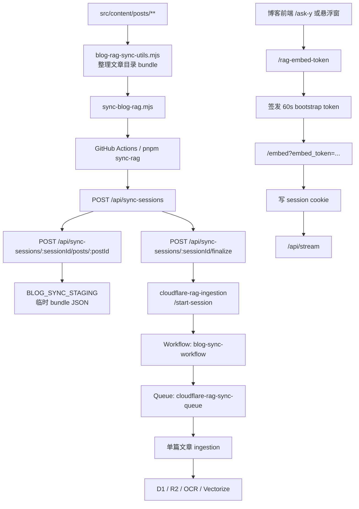

如果只看 Cloudflare 控制台里这次拆出来的独立 ingestion worker，以及它和 Queue、R2、Workflow、D1、Vectorize 的绑定关系，可以看看下面这张图。

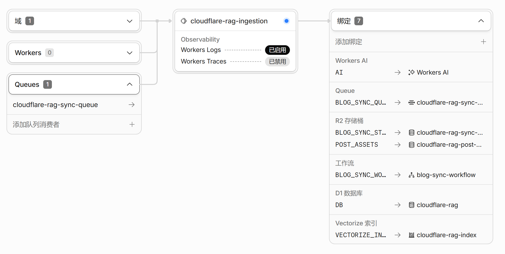

如果把职责拆开，其实就很清楚了。

博客这边主要负责两件事：

- 提供原始文章内容
- 给合法页面分发临时内嵌 token

RAG 这边主要也负责两件事：

- 把文章目录变成真正可检索的知识库
- 只允许持有合法 session 的 iframe 页面继续对话

## 这次迁移前，旧同步链路的问题

以前那套 `/api/sync-posts` 直连方案能跑，但结构上有几个很明显的缺点：

- 一次 HTTP 请求里把 R2、OCR、D1、embedding、Vectorize 全做完，太重
- 文章一长、图片一多，就容易碰到 `524` 或者中途超时
- 失败后很容易留下“半成品写了一半，但旧索引已经被影响”的状态
- 没有明确的 session 边界，GitHub Actions 只能看到一条长请求的成败
- 重建和增量没有真正分层，文章局部修改时很难做到只重算该重算的部分
- 日志和统计比较散，慢在 OCR、慢在 embedding、还是慢在 Vectorize，不好一眼看出来

所以这次我不是给旧请求继续加补丁，而是直接换成了：

- `session` 管一次同步会话
- `Queue` 管单篇文章异步入库
- `Workflow` 管整次同步收敛和清理
- `revision` 管文章更新和原子切换

这样一来，失败点、重试点、终态点都变清楚了。

## 我的博客侧，为什么不是只同步 Markdown 正文

如果只是做一个最简单的 demo，把 Markdown 正文扔给向量库当然也能跑。

但我自己的文章结构不是那种只有一篇 `index.md` 就结束的形式。  
很多文章目录下面本来就带着：

- `cover.png`
- 正文插图
- 局部截图
- SVG / JSON 这类辅助资源

所以我从一开始就不太想把它做成“只同步正文字符串”。

我最后采用的是目录级 bundle 方案。  
也就是说，`src/content/posts/<slug>/` 这个目录，本身就被我当成一个同步单元。

现在博客侧真正做这件事的是：

```text
scripts/blog-rag-sync-utils.mjs
scripts/sync-blog-rag.mjs
```

这两个脚本都在我的静态博客仓库里，不在 `cloudflare-rag/` 里面。

前者负责收集，后者负责发送。

说得更具体一点就是：

- `blog-rag-sync-utils.mjs` 负责把 `src/content/posts/**` 打成可上传的 bundle
- `sync-blog-rag.mjs` 负责把这些 bundle 通过 `session` 协议发到 Cloudflare

## `blog-rag-sync-utils.mjs` 现在到底在打什么包

这个脚本主要做几件事。

第一步，扫描 `src/content/posts/**`。  
只要是 `.md` 文件，它都会去读 frontmatter。

第二步，先做文章可同步性判断。  
也就是这些不会进知识库：

- `draft: true`
- `encrypted: true`
- 有 `password`

这一层很重要。

因为我这里的 RAG 同步不是“发文章摘要”，而是把文章目录原始内容直接送去 Cloudflare。  
既然这样，草稿和受保护页面就应该在博客侧先挡掉，而不是等到了云端再考虑。

第三步，按文章目录收集文件。

它会把当前文章目录里所有文件都列出来，然后按文件类型分别处理：

- 文本类资源用 UTF-8 直接传
- 二进制资源走 base64

最后整理出来的 payload，大概长这样：

```json
{
  "id": "cloudflare-rag-mizuki-ai-kb/index.md",
  "slug": "cloudflare-rag-mizuki-ai-kb",
  "entryPath": "index.md",
  "url": "https://ynga.kingcola-icg.cn/posts/cloudflare-rag-mizuki-ai-kb/",
  "metadata": {
    "title": "用 Cloudflare-RAG 给我的博客补一个 AI 知识库",
    "description": "...",
    "published": "2026-05-13",
    "tags": ["Cloudflare", "RAG"]
  },
  "files": [
    {
      "path": "index.md",
      "contentType": "text/markdown; charset=utf-8",
      "encoding": "utf8"
    },
    {
      "path": "cover.png",
      "contentType": "image/png",
      "encoding": "base64"
    }
  ],
  "contentHash": "..."
}
```

这里的 `contentHash` 不是装饰用字段。  
它后面会直接影响 Cloudflare 侧要不要重建这一篇文章的索引。

所以我现在这套同步不是“每次全文重传再全文重建”。  
而是文章目录内容没变，就直接跳过。

## 为什么要做目录级 bundle

说到底，还是因为这样更符合博客本身的结构。

如果只同步正文，会立刻失去两类信息：

- 文章资源路径
- 图片和截图的存在关系

而我这个博客里偏教程、部署、排错的文章很多时候最关键的内容，恰恰不是一句纯文本总结。  
它可能是：

- 某个面板截图
- 某段配置前后的对比图
- 某张流程图
- 某个文件路径的上下文

目录级 bundle 至少给了我一个继续往下做的基础。  
后面不管是做图片索引、R2 资源代理，还是做 OCR 补充，前提都是博客侧先把目录原样带过去。

## 现在这条同步链路，已经收进 GitHub Actions 了

我后来不太想每次写完文章，还得自己再手动执行一遍同步脚本。

所以我把这一层也接进了 GitHub Actions。

现在实际在跑的是：

```text
.github/workflows/deploy.yml
```

它监听的路径很明确：

- `src/content/posts/**`
- `scripts/blog-rag-sync-utils.mjs`
- `scripts/sync-blog-rag.mjs`

也就是说，平时最常见的情况其实就是：

```text
本地改文章
  ↓
git add / commit / push
  ↓
GitHub Actions 触发
  ↓
pnpm sync-rag
  ↓
POST /api/sync-sessions
```

现在 workflow 默认是增量同步。  
只有手动触发 `workflow_dispatch` 并勾选 `force_rebuild`，才会全量重建。

如果只看使用体验，这件事现在已经被压缩得很轻了。

我平时就是正常写文章。  
知识库同步不再是第二套单独维护流程。

这里我自己挺在意的一点是，文章的真实来源还是仓库。  
知识库只是消费仓库，不是反过来成为另一套内容主库。

这套链路接进 GitHub Actions 以后，CI 日志也不再只是一个“成功”或者“失败”。  
现在它会把本次 session 的创建、逐篇上传、Workflow 状态、聚合瓶颈、阶段耗时、最慢文章和终态总结直接打出来。  
这样就算我还没打开 Cloudflare 控制台，也能先在 Actions 里判断这次同步到底慢在 `bundle` 下载、`embedding`、`Vectorize`，还是某一篇文章本身。

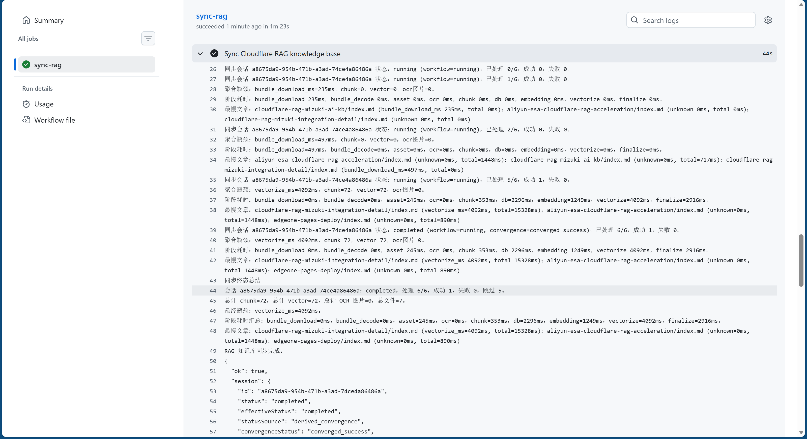

## `sync-blog-rag.mjs` 真正干了什么

这个脚本的角色其实很单纯。

它不会做复杂的 Markdown 解析。  
真正复杂的收集逻辑已经在 `blog-rag-sync-utils.mjs` 里了。

`sync-blog-rag.mjs` 做的主要是：

1. 读取博客配置里的默认同步地址和站点地址
2. 调用 `collectBlogRagPosts(...)`
3. 创建同步 session
4. 逐篇上传 bundle 到 `/api/sync-sessions/:sessionId/posts/:postId`
5. 调用 `finalize` 让 Cloudflare 侧开始编排
6. 轮询 session 状态，直到拿到终态总结

它同时也支持：

- `--dry-run`
- `--force`

所以现在如果我要做排查，也很方便。

比如先本地看一下它准备同步什么：

```bash
pnpm sync-rag:dry-run
```

如果我要强制让云端忽略 `contentHash` 重新构建：

```bash
pnpm sync-rag:force
```

这一层我没有把它做成很花哨的同步器。  
反而是尽量保持简单。

因为它本质上只是博客侧的“目录收集 + session 协议驱动”。

## Cloudflare-RAG 这边，真正接同步请求的是 `/api/sync-sessions`

博客侧现在不再直接把整批文章丢给一个大接口，而是先创建 session，再逐篇上传，再 finalize。

真正接住这些请求的，分成三层：

- `cloudflare-rag/functions/api/sync-sessions/index.ts`
- `cloudflare-rag/functions/api/sync-sessions/[sessionId]/posts/[postId].ts`
- `cloudflare-rag/functions/api/sync-sessions/[sessionId]/finalize.ts`

旧的 `/api/sync-posts` 现在已经退成迁移兼容入口，正常链路不再走它。

然后它会把会话转给独立的 ingestion worker：

- `cloudflare-rag-ingestion/src/index.ts`
- `cloudflare-rag-ingestion/src/workflow.ts`
- `cloudflare-rag-ingestion/src/queue.ts`

这里的核心变化是：

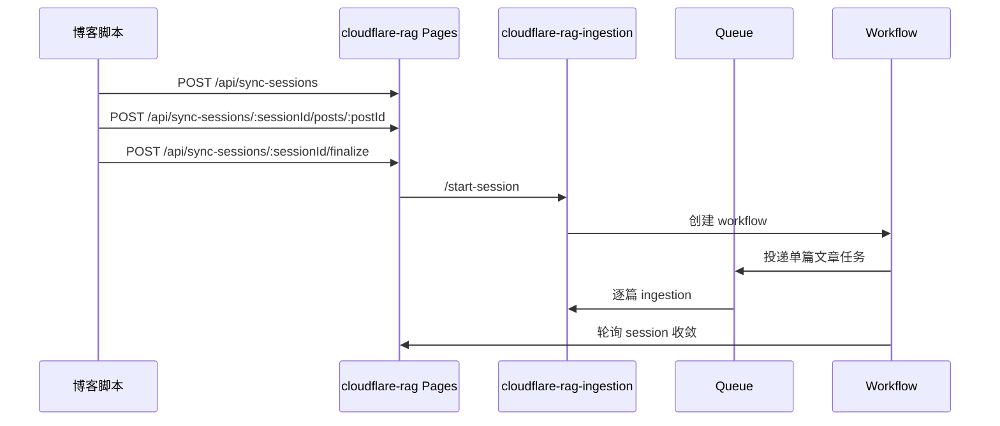

如果只看一遍图还不够直观，那其实可以把这条链路再拆成四个公开接口来看。  
这样 GitHub Actions、Cloudflare Pages、独立 ingestion worker、Queue、Workflow 分别在做什么，就会一下子清楚很多。

### 把同步链路拆开看，其实就是 4 个接口

第一步，博客侧脚本先创建 session：

- `POST /api/sync-sessions`

这一层做的事情很轻，只是在 D1 里先写一条 `blog_sync_sessions`，然后把 `sessionId` 返回给 `sync-blog-rag.mjs`。  
它的意义不是“开始重活”，而是**先给整次同步建立一个明确的会话边界**。

第二步，脚本逐篇上传文章目录 bundle：

- `POST /api/sync-sessions/:sessionId/posts/:postId`

这一层会做两件事：

- 把文章 bundle JSON 暂存到 `BLOG_SYNC_STAGING`
- 在 `blog_sync_session_posts` 里登记一条 `uploaded` 记录

也就是说，这一步还没有真正开始 OCR、embedding、Vectorize。  
它只是先把“本次要处理什么”稳定写下来。

第三步，全部上传完以后，再调用：

- `POST /api/sync-sessions/:sessionId/finalize`

这一步才会把 session 正式切到 `running`，写入：

- `expectedPostCount`
- `activePostIds`
- `forceRebuild`
- `pruneMissing`

然后再通过内部 `service binding` 调独立 ingestion worker 的：

- `POST https://blog-sync-ingestion.internal/start-session`

这里要特别强调一下，这个 `.internal` 不是公网地址。  
它是 `cloudflare-rag` 通过 `BLOG_SYNC_INGESTION` 这个 service binding，直接去调用 `cloudflare-rag-ingestion` worker 的内部入口。  
也就是说，**公网 API 负责接住博客脚本，内部 service binding 负责把重活转给 ingestion worker**。

第四步，也是 GitHub Actions 最关键的一步，就是它不会直接盯着 Cloudflare Workflow 控制台。  
它真正一直在轮询的是：

- `GET /api/sync-sessions/:sessionId`

这个公开状态接口会先读：

- `blog_sync_sessions`
- `blog_sync_session_posts`

如果当前还没到终态，再通过内部 service binding 去问 ingestion worker：

- `GET https://blog-sync-ingestion.internal/session-status?sessionId=...`

而 ingestion worker 这边的 `/session-status`，会继续把：

- Workflow 当前状态
- 单篇文章处理进度
- 会话聚合统计
- pending recovery 数量

这些内容一起汇总回来。  
最后 `cloudflare-rag` 再把它们聚合成公开的 `/api/sync-sessions/:sessionId` 响应，返回给 GitHub Actions。

不过我后来还是把 `cloudflare-rag-ingestion` 的 Workers Observability 打开了。  
因为 GitHub Actions 看到的是“对外聚合后的 session 状态”，而 Observability 看到的是 Worker 内部的真实执行轨迹。  
比如 `POST /start-session` 什么时候被打进来、`GET /session-status` 被轮询了几次、Queue 什么时候开始消费、Workflow 什么时候进入收敛阶段，这些都能直接在日志里看到。  
所以真遇到问题时，我不用再靠猜，就能更快判断到底是外部轮询没收敛，还是内部编排本身卡住了。

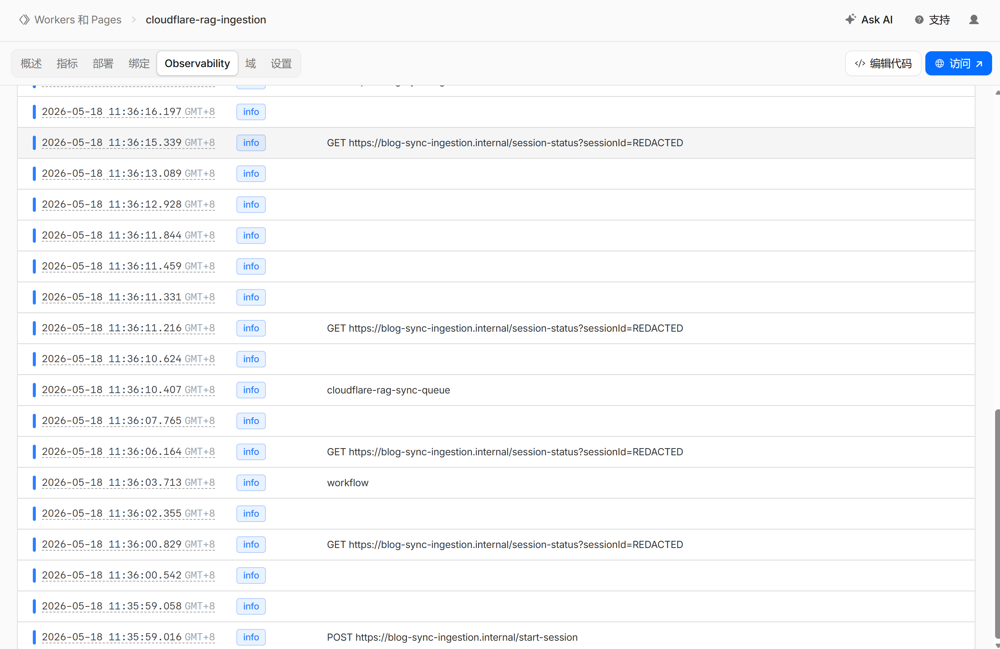

所以从本质上看，Actions 和 Cloudflare 的状态同步，不是靠 Workflow UI，也不是靠 Queue 面板，而是靠这条链路：

```text
Workflow / Queue / ingestion worker
  ↓
D1 + 内部 /session-status
  ↓
公开 /api/sync-sessions/:sessionId
  ↓
GitHub Actions 轮询直到判定完成
```

这也是为什么我后面修复 GitHub Actions 卡住时，不是去改 Workflow 页面，而是去强化这条状态汇总链路。  
因为真正负责“外部世界怎么看见 Cloudflare 当前同步状态”的，就是这个公开 session 状态接口。

### 现在 GitHub Actions 到底是怎么知道该停下来的

以前最容易出问题的点，是 GitHub Actions 只盯着 `session.status`。  
这样一来，只要 Workflow 实际完成了，但终态写回 D1 有一点延迟，Actions 就会继续在那里刷 `running`。

现在我把它改成了“双保险”：

- 服务端公开 `/api/sync-sessions/:sessionId` 时，不再只给一个 `status`
- 脚本 `sync-blog-rag.mjs` 也不再只认 `status`

现在它会同时看这些聚合字段：

- `effectiveStatus`
- `convergenceStatus`
- `allProcessed`
- `hasFailures`
- `pendingRecoveryCount`

这几个字段组合起来以后，GitHub Actions 判断终态的逻辑就变成了：

- 如果服务端已经明确返回终态，那就直接停
- 如果原始 `status` 还没切终态，但聚合统计已经连续几轮都显示“全部文章处理完、没有待恢复任务、结果稳定”，那也会稳定退出

这样就不会再出现“Cloudflare Workflow 实际上已经完成了，但 GitHub Actions 还在傻轮询”的错位感。

### 用一张时序图看 4 个接口和状态回流

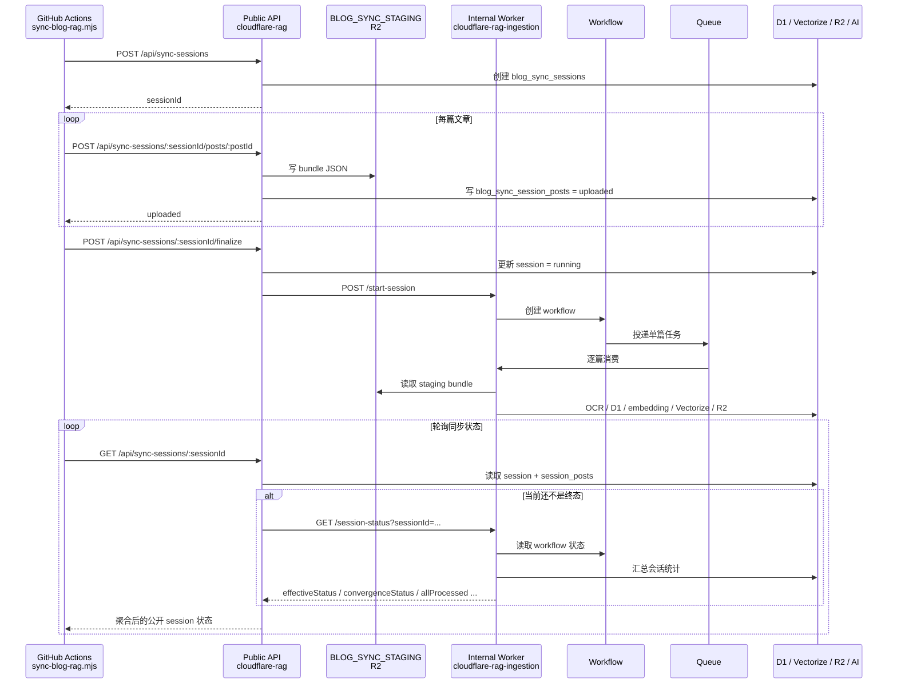

### 再用一张架构图看公网 API 和内部 service binding 的边界

这张图是我自己后来最喜欢的一种理解方式。  
因为它把“谁是公开入口，谁是内部调度，谁在真正干重活”拆得非常清楚。

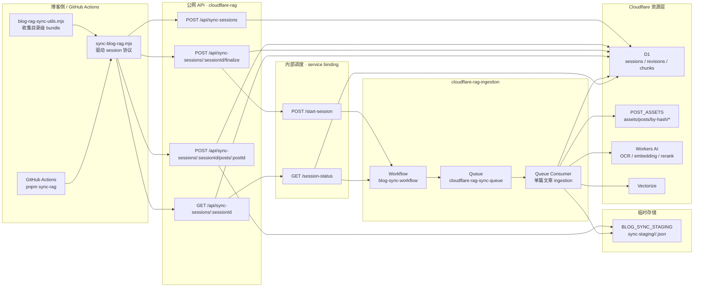

如果按职责把这张图说明白一点，其实就是：

- `cloudflare-rag` 这一层是**公网入口**
- `cloudflare-rag-ingestion` 这一层是**内部调度和重活执行**
- `BLOG_SYNC_STAGING` 是**临时中转**
- `POST_ASSETS` 是**长期资产库**
- `Queue` 负责**单篇解耦**
- `Workflow` 负责**整次同步收敛**

这样再回头看，就会明白这次升级不是单纯把旧接口换了个名字。  
而是把原来一个大请求里塞满的所有事情，拆成了：

- 会话入口
- 单篇上传
- 编排启动
- 状态汇总

四个公开协议步骤，再加上内部的：

- service binding
- Queue
- Workflow
- ingestion worker

这一整套异步入库管线。

Queue 这一层的结构其实很直观，本质上就是 ingestion worker 既是 producer，也是 consumer，中间由 `cloudflare-rag-sync-queue` 这条队列做解耦。

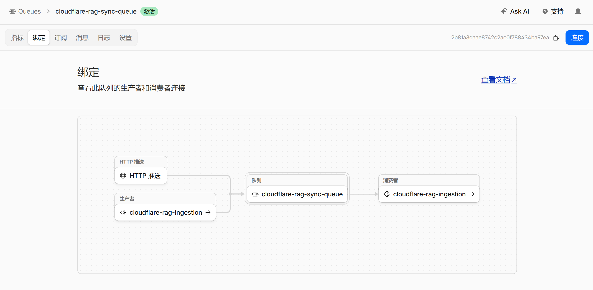

如果再往里看 Workflow 本身的主干流程，它其实就是一个“投递任务 -> 等待收敛 -> finalize”的循环编排。

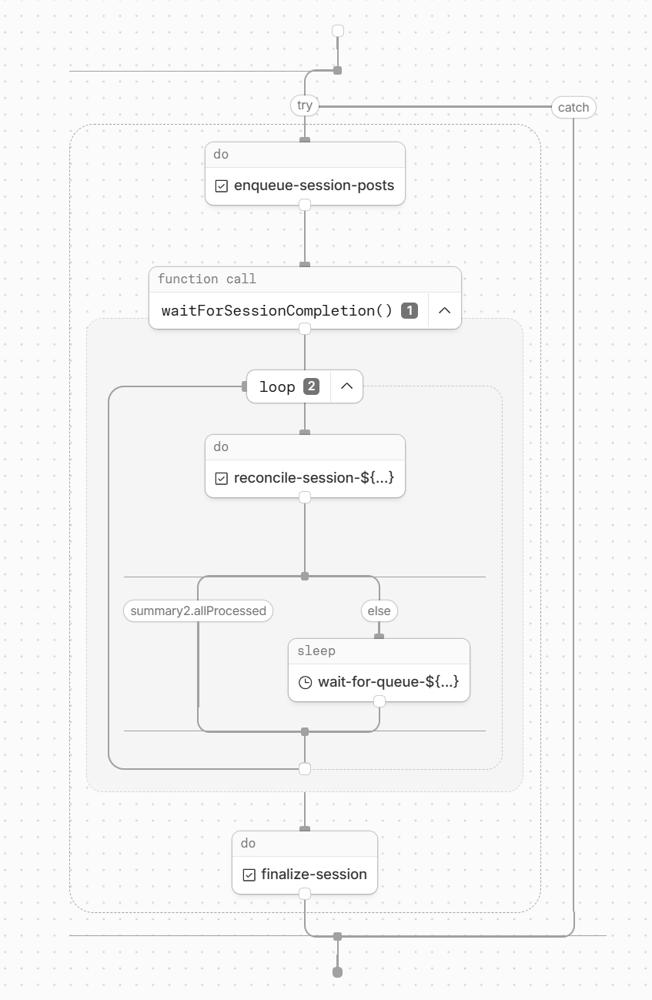

这次我把它拆开的原因很直接：

- `Pages` 只负责会话入口和鉴权
- `Queue` 只负责单篇文章异步处理
- `Workflow` 只负责整次同步的编排和收敛

这样就不会再把 OCR、embedding、Vectorize upsert 这些重活塞进一个 HTTP 请求里。

### 这次同步里，R2 的职责分工

现在我把 R2 拆成了两个层次：

- `BLOG_SYNC_STAGING`
  - 只放这一次同步会话的临时 bundle JSON
  - 路径是 `sync-staging/<sessionId>/<postId>.json`
  - 处理完就删

- `POST_ASSETS`
  - 只放长期有效的文章资源
  - 新路径是 `assets/posts/by-hash/<contentHash>`
  - 旧的 `posts/<slug>/...` 只是 legacy 路径

在 Cloudflare 控制台里，对应的 bucket 分别是：

- `cloudflare-rag-sync-staging`
- `cloudflare-rag-post-assets`

这意味着：

- staging 是短期的
- assets 是长期的
- 老目录不会继续作为主路径存在

真正跑起来以后，Workflow 在执行中的样子也很有代表性。  
你会看到它不断在 `reconcile-session-*` 和 `wait-for-queue-*` 之间循环，这一层就是它在等 Queue 全部收敛。

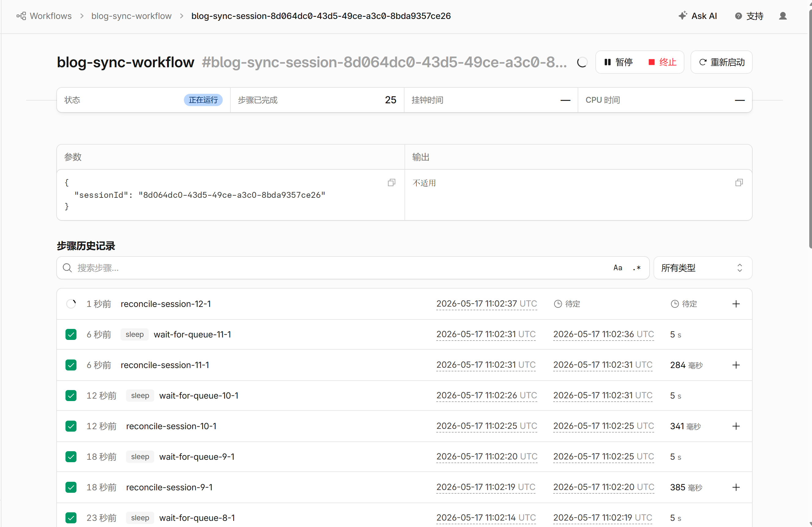

而当整次同步彻底完成以后，Workflow 最终会进入 `finalize-session`，输出 `completed` 和清理统计，这时候 GitHub Actions 那边也应该同步拿到终态。

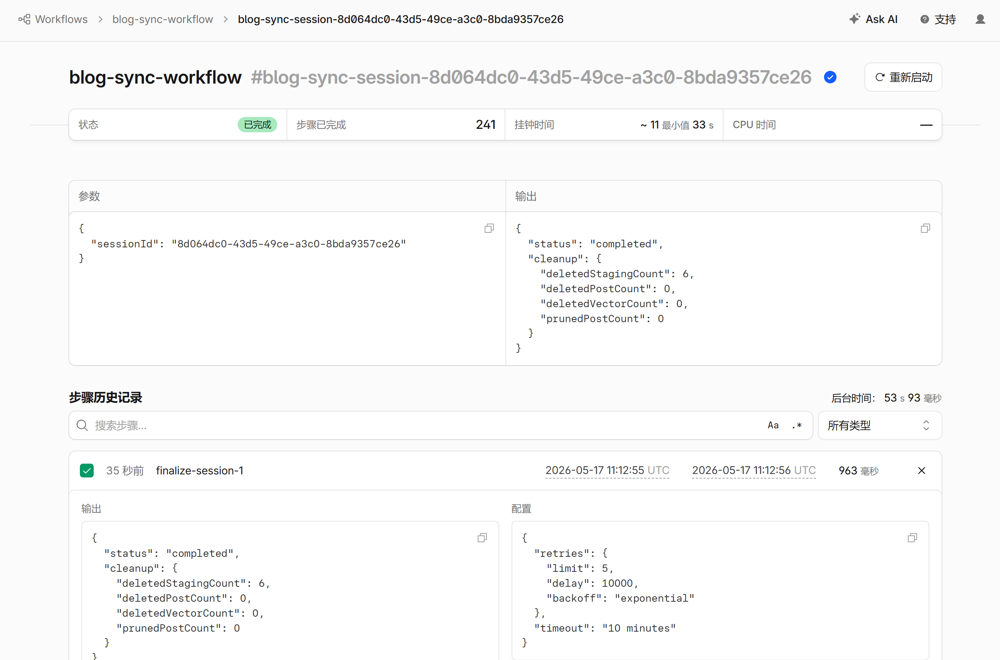

### Queue 和 Workflow 的参数

现在线上默认参数大概是：

- Queue consumer 通过 `BLOG_SYNC_QUEUE` 绑定
- Workflow 名字是 `blog-sync-workflow`
- Workflow class 是 `BlogSyncWorkflow`
- Workflow 轮询间隔是 `5000ms`
- Workflow 超时窗口是 `15min`
- 单篇文章最大尝试次数是 `3`
- processing lease 是 `10min`
- Queue 侧遇到 lease 过期会延迟 `5s` 重投

这个组合的目标不是极限吞吐，而是稳定收敛。

### 现在同步时到底会发生什么

单篇文章真正的重活现在都在 ingestion worker 里完成：

1. 从 staging R2 取 bundle
2. 解析 frontmatter / 正文 / 图片引用
3. 先把正式资源写入 `POST_ASSETS`
4. 对引用图片做 OCR 缓存命中或生成
5. 写 D1 的 `blog_posts / blog_post_revisions / blog_post_sections / blog_post_chunks / blog_post_images`
6. 生成 embedding
7. upsert 到 Vectorize
8. 成功后切换 `current_revision_id`
9. 写回 session post 状态和阶段指标

这样以后文章局部改动时，就不必整篇硬删硬建。

### 增量同步到底怎么判定

这里把话说得直白一点就是：**博客侧每次上传的还是当前公开文章清单，但 Cloudflare 侧不会因此把所有文章都重新入库。**

真正决定“要不要重算”的，不是上传动作本身，而是 Cloudflare 这层按 `session + revision + contentHash + forceRebuild` 做的逐篇判定。

更准确地说，这次同步会按下面的顺序判断：

1. 先用 `activePostIds` 确定这次 session 真正要处理哪些文章
2. 再读取每篇文章 bundle 里的 `contentHash`
3. 再查这篇文章当前的 `blog_posts.current_revision_id`
4. 如果当前 revision 已经是 `completed`，并且 `contentHash` 没变、`forceRebuild=false`，就整篇 `skipped`
5. 如果是新增文章，或者 `contentHash` 变了，就只对这篇文章重建新的 `revision`
6. 如果是 `forceRebuild=true`，则不允许整篇跳过，但仍然尽量复用已经稳定的资源和缓存结果

所以这里不是“整站文章全部重新入库”，而是：

```text
当前公开文章清单
  ↓
Cloudflare 逐篇看 contentHash / current_revision / forceRebuild
  ↓
没变且已完成的文章直接跳过
  ↓
新增或有改动的文章只重建自己的 revision
```

再往下拆一层，真正被重算的也不是“整个知识库”，而只是这篇文章对应的新 revision：

- 文章正文、sections、chunks 只会对变更文章重新生成
- 图片如果 `contentHash` 没变，会继续命中 `assets/posts/by-hash/<contentHash>` 和 `POST_ASSETS`
- OCR 如果图片内容没变，会继续命中 `blog_image_ocr_cache`
- embedding / Vectorize 也只会对这篇变更文章的有效 chunk 重新写入

也就是说，**Cloudflare 这一层的增量策略，本质上是“文章级增量 + 资源级缓存复用”**，不是每次把全部内容都重新入库。

再补一个边界：**我现在这套实现的增量粒度还是“文章级 revision”，不是“文章内部 chunk 级差分更新”。**

也就是：

- 如果文章完全没变，这一篇会整篇跳过
- 如果文章变了，当前实现还是会把这篇文章的新 revision 整体重建一遍
- 但这次整体重建只发生在这篇文章身上，不会波及其他没变的文章
- 而且图片资源、OCR 结果、正式 R2 对象这些能复用的层，仍然会按哈希继续复用

如果是 `forceRebuild=true`，它的含义也要说清楚：

- 不再允许整篇文章按 `contentHash` 直接跳过
- 但相同且稳定的资源、OCR 结果、embedding 仍然尽量复用
- 这次重建只针对 session 里选中的文章，不会把知识库里所有历史文章都硬洗一遍

所以说，**全量重建不是“全库重算”，而是“对本次目标文章逐篇重建 revision，并尽可能复用已有缓存”**。

### 全量重建、增量重建和旧数据清理

实现过程中最注意的一点，其实不是“能不能重建”，而是“重建时会不会把旧索引先删掉”。

现在这套 revision 模型里：

- 增量同步时，`contentHash` 没变就跳过
- `forceRebuild=true` 时，不再整篇跳过，但资源上传、OCR、embedding 仍然尽量命中缓存
- 真正切换对外服务的是 `current_revision_id`
- 只有新 revision 成功以后，旧 revision、旧向量、旧 staging bundle 才进入清理阶段

也就是说，现在的全量重建不是“先删旧数据再建新数据”，而是：

```text
先构建新 revision
  ↓
成功后切换 current_revision_id
  ↓
再清旧 revision / 旧 vector / 旧 staging
```

这也是为什么这次全量重建做完以后，我可以比较放心地把历史 `posts/<slug>/...` 目录逐步收掉。  
因为数据库里的活引用已经切到新的 `assets/posts/by-hash/<contentHash>` 了。

### 旧方案的缺点和新方案的优势

| 旧方案 | 新方案 |
| --- | --- |
| `/api/sync-posts` 一把做完 | session / queue / workflow 分层 |
| 容易 524 和半成品 | 会话可恢复、可重试、可收敛 |
| 没有清晰的进度和瓶颈 | 有 session 聚合指标和最慢文章 |
| 文章改动经常触发整篇 churn | revision 化，能做稳定增量 |
| R2 / D1 / Vectorize 互相耦合 | 每层职责更单一 |

### 迁移后的可观测性

现在每次同步都会记录：

- `bundle_download_ms`
- `bundle_decode_ms`
- `asset_upload_ms`
- `ocr_ms`
- `chunk_build_ms`
- `db_write_ms`
- `embedding_ms`
- `vectorize_ms`
- `finalize_ms`

另外我还把 Workers Logs 打开了，ingestion worker 会输出带 `sessionId / postId / stage` 的结构化日志。  
这样我在 Cloudflare 仪表板里就能直接看出本次慢在 OCR、embedding，还是 vectorize。

## 我现在在 D1 里拆了更多层表

为了让检索链路更清楚，我这边把博客知识库和同步会话拆成了这些表：

- `blog_posts`
- `blog_post_revisions`
- `blog_post_sections`
- `blog_post_chunks`
- `blog_post_images`
- `blog_sync_sessions`
- `blog_sync_session_posts`
- `blog_image_assets`
- `blog_image_ocr_cache`

大概可以这么理解：

- `blog_posts` 负责文章级元数据和当前 revision 指针
- `blog_post_revisions` 负责一次同步生成的版本快照
- `blog_post_sections` 负责“这一节讲了什么”
- `blog_post_chunks` 负责真正喂给检索和生成的最小文本单元
- `blog_post_images` 负责图片资源和图片上下文
- `blog_sync_sessions` 负责整次同步会话
- `blog_sync_session_posts` 负责单篇文章的处理状态和阶段指标
- `blog_image_assets` 负责正式 R2 资源引用计数
- `blog_image_ocr_cache` 负责 OCR 结果复用

这套拆法不是为了“看起来规范”。

而是因为我后面在检索阶段，确实需要这些粒度信息。

比如一段 chunk 检索出来以后，我还想知道：

- 它是不是图片相关
- 它是不是代码相关
- 它属于哪个 heading
- 它对应的图片资源 URL 是什么

如果前面不先拆开，后面这些都只能临时推断，准确性会差很多。

## 图片为什么也能跟着进知识库

我这边后面继续改得比较多的一块，就是图片。

因为博客文章不是纯文本。  
很多教程里真正重要的信息，其实在截图里。

现在 `postBundleIndexing.ts` 会先把文章里引用到的图片资源整理出来。  
除了基础字段：

- `relativePath`
- `alt`
- `title`
- `heading`
- `anchor`
- `surroundingText`

与此同时，还会额外对图片做一层 OCR / 图片转 Markdown 文本，把结果塞进 `ocrText`。

所以现在图片不只是“能显示”。  
它在知识库里也会变成一类可以参与匹配的辅助信息。

当然，我不想把这件事说得太夸张。

它现在还不是一个成熟的多模态知识库系统。  
更准确一点的说法应该是，我尽量把博客里原本只适合人眼看的内容，也往“可检索”推了一层。

## `/api/assets/posts/**` 这一层，是给文章资源做代理的

因为图片和其他文件已经先落进了 R2，所以后面还要有一个读取入口。

这层就是：

```text
cloudflare-rag/functions/api/assets/[[path]].ts
```

它现在只允许访问 `posts/` 前缀下的对象键。  
而且会过滤掉不安全路径，比如 `.`、`..` 这种。

这一层做完以后，图片索引里就可以把资源地址统一写成：

```text
/api/assets/posts/by-hash/<contentHash>
```

现在真正长期保留的正式资源是在：

```text
assets/posts/by-hash/<contentHash>
```

这样前端和聊天引用时，不需要直接暴露 R2 bucket 细节。  
资源路径也更可控。

## 真正回答问题的时候，我不是直接向量检索一下就结束

聊天入口现在主要在：

```text
cloudflare-rag/functions/api/stream.ts
```

我后来在这里补了不少自己的逻辑。  
不然它很容易退化成那种“查一下最相似段落，然后硬答”的普通 demo。

我现在这条问答链路，大概是这样：

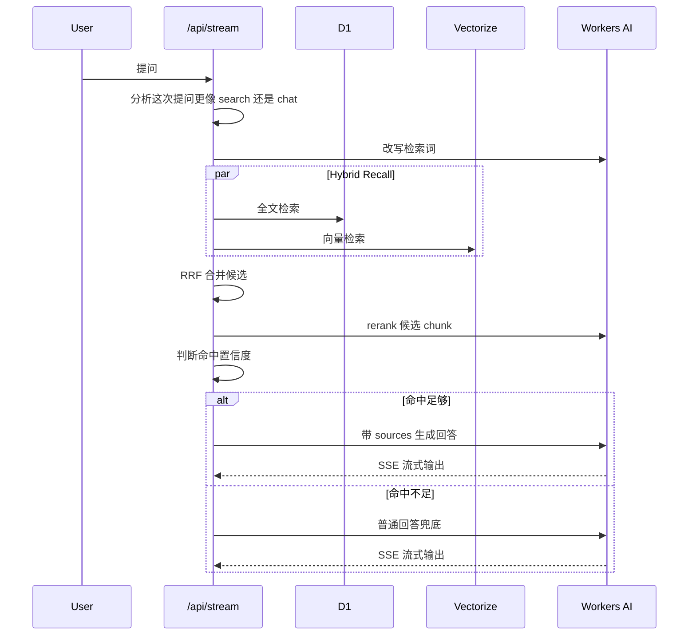

如果只看代码，里面我比较看重的是这几层。

### 1. 先判断这次问题到底要不要走博客检索

不是所有问题都适合强行走 RAG。

比如用户只是：

- 问你是谁
- 问你能做什么
- 闲聊
- 问一个明显不依赖站内内容的泛问题

这种时候，强行去全文检索博客内容反而会把回答搞得很怪。

所以我先加了一层 retrieval preference 分析。  
先判断它更像：

- `search`
- 还是 `chat`

如果它更像普通对话，而且置信度已经够高，就直接走一般性回答。

### 2. 检索不是单路，而是全文检索和向量检索并行

我现在不会只跑向量检索。

因为博客这种内容有一个特点。  
有些问题特别依赖关键词、配置名、路径名、命令名，这时候全文检索就很重要。  
但有些问题又更像语义问法，这时候向量检索更有效。

所以我现在两条都跑：

- `searchFullText(...)`
- `queryVectorIndexWithPreferences(...)`

然后再用 `reciprocal rank fusion` 合并候选。

这一步的收益很现实。

它不一定让每个问题都更聪明，但会让很多博客场景下的命中更稳。  
尤其是部署、配置、报错这类问法，关键词和语义本来就都重要。

### 3. 候选命中了也不会直接拿去答，还要 rerank

RRF 合完以后，我还会再走一层 rerank。

用的是：

```text
@cf/baai/bge-reranker-base
```

这一步的作用很简单，就是把“看起来像候选”的东西再排一遍顺序。

这样后面真正喂给模型的，就不再是原始检索顺序，而是相关性更高的一组 chunk。

### 4. 后来又补了“命中不够就别硬答”

这一层我自己很在意。

因为个人博客知识库最糟糕的情况，不是回答不了。  
而是明明没命中准，还装得像已经找到了站内依据。

所以我后面又加了一层 retrieval confidence 判断。  
如果：

- rerank 分数太低
- 候选过于模糊
- 单源命中太弱

那它就直接退回普通回答，而不是硬引用博客内容。

我宁可它老实一点，也不想它一本正经地胡说。

## 为什么要单独做 `ask-y` 页面

真正把聊天挂回博客以后，我后来没有只保留右下角悬浮窗。

因为悬浮窗适合：

- 阅读时顺手问一句
- 快速追问某个点

但如果用户真的想把它当成一个围绕博客内容工作的助手来用，悬浮窗其实还是偏小。

所以我后来又单独做了：

```text
src/pages/ask-y.astro
```

这个页面本质上还是在嵌同一个受保护的 RAG embed。  
只是它给了一个更完整、更沉浸的对话入口。

现在前端这边大概就是两个入口并存：

- `AiChatWidget.astro` 负责悬浮聊天窗
- `ProtectedRagEmbed.astro` + `ask-y.astro` 负责完整对话页

## 真正麻烦的不是“嵌进去”，而是“不能被别人直接打开”

如果只是想把 RAG 页面塞进 iframe，其实事情不难。

真正让我后来继续往下补的，是这个问题：

> `https://rag.ynga.kingcola-icg.cn/embed` 不能变成一个任何人都能直接打开的公开聊天页。

因为对我来说，`cloudflare-rag` 现在已经不是独立站点。  
它是博客后面拆出去的一个知识库子服务。

也就是说，我真正想要的是：

- 博客正式域名可以正常内嵌
- 其他任意域名不能随便嵌
- 用户也不能直接访问 `rag` 域名单独聊天

这就是后面这套 token + session 的来源。

## 博客侧先发 token，不直接暴露最终 embed URL

我现在博客侧专门做了一个 Edge Function：

```text
edge-functions/rag-embed-token/index.js
edge-functions/rag-embed-token/proxy.js
```

它的职责很单纯。

不是直接返回聊天页面。  
而是先分发一个短时效 bootstrap token。

这个 token 现在是 HMAC 签名的，博客侧和 RAG 侧共享同一个：

```text
RAG_EMBED_SHARED_SECRET
```

协议字段基本固定成这样：

- `v`
- `iss`
- `aud`
- `kind`
- `origin`
- `path`
- `iat`
- `exp`

其中关键约束包括：

- `kind=bootstrap`
- `origin=https://ynga.kingcola-icg.cn`
- `path=/embed`
- TTL 是 60 秒

也就是说，这个 token 不是拿来长期用的。  
它只是第一次打开 iframe 时的引导凭证。

## 这个 token 也不是谁来请求都给

博客侧的 `/rag-embed-token` 不是公开 token 机。

现在它会检查：

- 当前请求 origin 是不是博客正式域名
- referer 是不是博客正式域名
- `sec-fetch-site` 是不是 `same-origin` / `none`

只有满足这些基本同源条件，它才会签发 token。

所以现在它的角色更像：

> 博客自己的页面，向博客自己的边缘函数申请一次性 embed 通行证。

这一层把很多乱七八糟的跨站请求先挡在博客侧了。

## 前端真正挂 iframe 的时候，是先取 token 再拼 URL

现在不管是悬浮窗还是 `ask-y` 页面，底层都不是静态写死：

```text
https://rag.ynga.kingcola-icg.cn/embed
```

它们现在的流程都是：

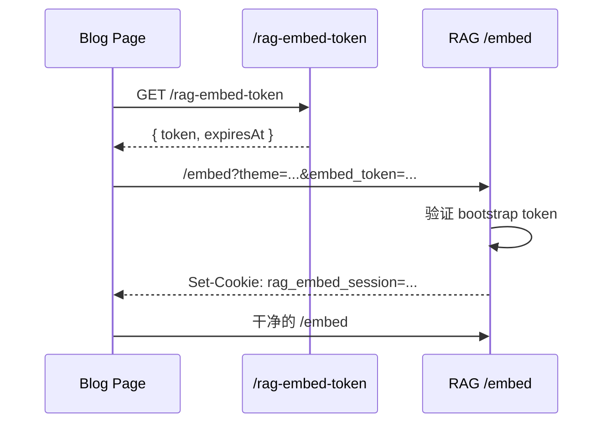

这一层现在主要体现在两个前端组件里：

- `src/components/control/AiChatWidget.astro`
- `src/components/rag/ProtectedRagEmbed.astro`

它们都是先请求 `BLOG_RAG_TOKEN_ENDPOINT`，拿到 token 以后，再把 iframe `src` 设置成：

```text
https://rag.ynga.kingcola-icg.cn/embed?theme=...&embed_token=...
```

这样做有一个很直接的好处。

最终真正可用的访问 URL，不会提前硬编码在静态 HTML 里。  
而是只有在博客页面实际打开、并且 token 请求成功时，iframe 才会真正导航过去。

## RAG 侧真正的入口控制，在 `functions/[[path]].ts`

Cloudflare-RAG 这边真正兜住路由的是：

```text
cloudflare-rag/functions/[[path]].ts
```

这里现在的策略很明确：

- `/` 直接 404
- `/embed` 走专门的授权逻辑
- 其他请求继续交给 Remix / Functions

所以现在 `rag` 这个域名从外面看，不再是一个完整公开站点。  
顶层直接访问就是没东西。

这其实正是我想要的结果。

## `/embed` 这一层，现在只认两种合法状态

真正的 embed 访问控制在：

```text
cloudflare-rag/functions/_shared/embed-access.js
```

这层现在只认两种情况：

### 情况一，已经带了合法 `rag_embed_session` cookie

如果用户之前已经通过合法 bootstrap token 建过会话，那后续直接放行到真正的 `/embed` 页面。

### 情况二，当前没 session，但 URL 上带了合法 `embed_token`

这时候它会：

1. 验证 token 签名
2. 检查 origin / path / kind / exp
3. 签发一个 `session` token
4. 写入 `rag_embed_session` cookie
5. 302 跳转到干净的 `/embed?theme=...`

这一步里 session cookie 现在的特征也比较明确：

- `HttpOnly`
- `Secure`
- `SameSite=Strict`
- 默认 `Max-Age=30min`

也就是说：

- bootstrap token 只活 60 秒
- 真正持续对话靠的是 30 分钟 session

这比一直把一次性 token 挂在 URL 上要干净得多。

## 为什么直接访问 `/embed` 还是 404

这部分我后来是故意这样收的。

现在 `/embed` 就算你已经拿到某个 rag 域名链接，也不是点开就能用。

因为它除了 token / session 之外，还会额外看请求形态：

- `referer` 必须是博客正式域名
- `sec-fetch-dest` 必须是 `iframe`
- `sec-fetch-site` 必须是 `same-site` 或 `same-origin`

所以它现在本质上是在要求：

> 这真的是从博客页面里嵌进来的 iframe 请求，而不是用户自己手动在地址栏里打开。

这就是为什么我现在可以做到：

- 博客里正常内嵌可用
- 单独把 rag 域名贴浏览器里打不开

## `/api/stream` 也不会再接受匿名请求

如果只把 `/embed` 收住，但 `/api/stream` 还能匿名访问，那其实还是没关严。

所以现在 `stream.ts` 入口一开始就会先走：

```text
authorizeEmbedStreamRequest(...)
```

没有合法 `rag_embed_session`，直接 `404`。  
有 session 才继续往下跑问答逻辑。

而且每次通过合法 session 请求成功时，它还会顺手续签一次 session cookie。  
所以这套会话不是死的，而是一个滑动续期的状态。

这个设计我觉得挺合适现在这个场景。

它既不会让 bootstrap token 长时间暴露在 URL 里，  
也不会让用户刚打开 iframe 没多久就突然掉授权。

## 为什么我还补了 `frame-ancestors`

就算有 token 和 session，我后来还是在 `/embed` HTML 响应上补了：

```text
Content-Security-Policy: frame-ancestors https://ynga.kingcola-icg.cn
```

这一层的意义很简单。

它不是解决“用户直接访问”的问题。  
而是解决“别的站点能不能把这个页面也嵌进去”的问题。

也就是说，就算某些情况下 URL 被别人知道了，  
浏览器层面也会继续限制只有博客正式域名能正常 iframe 这个页面。

这一层和 token/session 不是替代关系，而是叠加关系。

## 这套东西为什么要拆成博客边缘函数 + Cloudflare Functions 两层

如果只看实现，可能有人会觉得这套有点绕。

但我最后还是觉得拆成两层是对的。

博客侧 Edge Functions 负责：

- 站内同源校验
- 分发 bootstrap token
- 控制只有博客页面能申请 token

RAG 侧 Cloudflare Functions 负责：

- 验证 token
- 建立 session cookie
- 限制 `/embed` 和 `/api/stream`
- 附加 `frame-ancestors`

两边职责分开以后，整个边界会清楚很多。

如果只让 RAG 侧自己既做 token 分发、又做渲染、又做会话，  
博客这边就失去了对“谁有资格申请通行证”的第一道控制。

现在这样更像两段式访问：

- 博客先说，这个 iframe 是我自己页面发起的
- RAG 再说，好，我给它一段短会话

如果只看部署位置，我现在会把它理解成下面这张图。

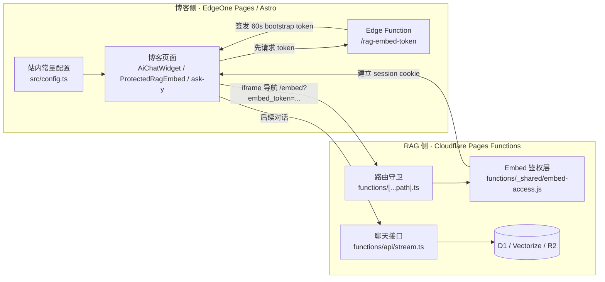

如果按职责来拆，也很清楚：

- 博客侧主要负责“谁能申请 embed token”
- RAG 侧主要负责“拿着这个 token 的 iframe 能不能真的建立会话并继续聊天”

我自己比较喜欢这种分层。

因为它不会把所有判断都塞进同一个地方。  
博客先做一层同源控制，RAG 再做一层会话和 iframe 形态控制，边界会更稳。

## 现在这套东西，实际要配哪些 Secret 和环境变量

如果只看代码改动，这套链路确实不少。  
但真正上线时需要盯住的配置，反而没有想象中那么多。

我现在会把它分成三层来看：

- 博客仓库运行时常量
- 博客侧 Secret / CI 变量
- Cloudflare-RAG 侧 Secret / Pages 变量

### 1. 博客仓库里固定写死的常量

这些现在主要统一放在：

```text
src/config.ts
edge-functions/config.js
```

和这篇文章相关的核心常量主要是：

```ts
BLOG_RAG_SERVICE_ORIGIN = "https://rag.ynga.kingcola-icg.cn"
BLOG_RAG_SITE_ORIGIN = "https://ynga.kingcola-icg.cn"
BLOG_RAG_SYNC_ENDPOINT = "https://rag.ynga.kingcola-icg.cn/api/sync-sessions"
BLOG_RAG_EMBED_URL = "https://rag.ynga.kingcola-icg.cn/embed"
BLOG_RAG_TOKEN_ENDPOINT = "/rag-embed-token"
BLOG_RAG_SITE_URL = "https://ynga.kingcola-icg.cn/"
```

以及博客边缘函数那边的：

```js
ALLOWED_BLOG_ORIGIN = "https://ynga.kingcola-icg.cn"
```

这一层不是 Secret。  
它更像是“当前正式站点和 RAG 服务的固定地址约定”。

如果后面换域名，优先改这一层。

### 2. 博客侧真正需要保密的值

博客这边运行时真正敏感、必须保密的，核心其实只有一个：

```text
RAG_EMBED_SHARED_SECRET
```

这个值会被博客侧 Edge Function 用来签发 bootstrap token。  
RAG 侧也必须配置成完全相同的值，否则：

- `/rag-embed-token` 能签出来
- 但 `cloudflare-rag` 验证不过
- 最后 iframe 会直接失败

所以这里最关键的不是“有没有配”，而是：

> 博客侧和 Cloudflare-RAG 侧必须是同一个值。

我是直接使用 PowerShell 先生成一段足够长的随机字符串：

```powershell
[Convert]::ToBase64String([Security.Cryptography.RandomNumberGenerator]::GetBytes(48))
```

然后把同一个值同时放到两边。

### 3. 博客仓库里和 GitHub Actions 相关的变量

如果你希望像我现在这样，文章 `git push` 以后自动触发同步，那 GitHub Actions 这一层还有几个值要配。

现在 `deploy.yml` 用到的是：

```text
BLOG_RAG_SYNC_TOKEN
BLOG_RAG_SYNC_ENDPOINT
BLOG_RAG_SITE_URL
```

其中：

- `BLOG_RAG_SYNC_TOKEN`  
  这是 GitHub Actions 里用来调用 `/api/sync-sessions` 的 Bearer Token  
  建议放在 GitHub `Secrets`

- `BLOG_RAG_SYNC_ENDPOINT`  
  一般就是 `https://rag.ynga.kingcola-icg.cn/api/sync-sessions`  
  放在 GitHub `Variables` 就够了

- `BLOG_RAG_SITE_URL`  
  一般就是 `https://ynga.kingcola-icg.cn/`  
  放在 GitHub `Variables`

- `BLOG_RAG_FORCE_REBUILD`  
  平时默认是 `false`  
  只有 `workflow_dispatch` 手动触发并勾选 `force_rebuild` 时，才会临时变成 `true`

如果本地要手动跑同步脚本，也可以直接在本地 `.env` 里配：

```dotenv
BLOG_RAG_SYNC_TOKEN=your-sync-token
BLOG_RAG_SYNC_ENDPOINT=https://rag.ynga.kingcola-icg.cn/api/sync-sessions
BLOG_RAG_SITE_URL=https://ynga.kingcola-icg.cn/
```

### 4. Cloudflare-RAG 侧必须有的 Secret

RAG 侧现在至少有两个 Secret 是必须的：

```text
RAG_SYNC_TOKEN
RAG_EMBED_SHARED_SECRET
```

它们各自负责的事不一样：

- `RAG_SYNC_TOKEN`  
  保护 `/api/sync-sessions`  
  没有它，博客侧不能往知识库里推文章

- `RAG_EMBED_SHARED_SECRET`  
  验证博客侧签发的 bootstrap token，并生成 session cookie  
  没有它，受保护 iframe 根本建立不了合法会话

直接用 Wrangler 配：

```bash
pnpm exec wrangler pages secret put RAG_SYNC_TOKEN --project-name cloudflare-rag
pnpm exec wrangler pages secret put RAG_EMBED_SHARED_SECRET --project-name cloudflare-rag
```

### 5. Cloudflare-RAG 侧的 Pages 变量

除了 Secret 之外，`wrangler.toml` 这边现在还有几项关键变量：

```toml
BLOG_SITE_URL = "https://ynga.kingcola-icg.cn/"
BLOG_CORPUS_ID = "mizuki-blog"
EMBEDDING_MODEL = "@cf/baai/bge-m3"
CHAT_MODEL = "@cf/qwen/qwen3-30b-a3b-fp8"
RERANK_MODEL = "@cf/baai/bge-reranker-base"
```

这些里需要在意的是下面三项：

- `BLOG_SITE_URL`  
  这个值会被 RAG 侧拿来推导唯一允许的博客 origin  
  如果它写错，`/embed` 和 `/api/stream` 这层授权会直接出问题

- `EMBEDDING_MODEL`  
  它必须和当前 Vectorize index 的维度匹配  
  我现在这边默认还在用 `@cf/baai/bge-m3`

- `CHAT_MODEL` / `RERANK_MODEL`  
  这两个决定问答和重排阶段到底跑什么模型

### 6. 严格来说，它们还依赖几类 Cloudflare 绑定

这些不是 Secret，但没有的话服务也跑不起来：

- `BLOG_SYNC_QUEUE`
- `BLOG_SYNC_WORKFLOW`
- `BLOG_SYNC_INGESTION`
- `AI`
- `VECTORIZE_INDEX`
- `DB`
- `rate_limiter`
- `BLOG_SYNC_STAGING`
- `POST_ASSETS`

可以简单理解成：

- `BLOG_SYNC_QUEUE` 负责单篇文章任务投递
- `BLOG_SYNC_WORKFLOW` 负责整次 session 编排
- `BLOG_SYNC_INGESTION` 负责把 Pages 的 finalize 请求转到独立 Worker
- `AI` 负责 embedding / rerank / chat
- `VECTORIZE_INDEX` 负责向量检索
- `DB` 是 D1
- `rate_limiter` 是 KV
- `BLOG_SYNC_STAGING` 是临时 bundle 存储
- `POST_ASSETS` 是 R2

所以如果你后面要复刻这篇文章里的方案，我自己建议按这个顺序检查：

1. 域名常量是不是对的
2. 两边 `RAG_EMBED_SHARED_SECRET` 是不是同一个值
3. `RAG_SYNC_TOKEN` 和 GitHub Actions 里的 `BLOG_RAG_SYNC_TOKEN` 是不是配对的
4. `BLOG_SITE_URL` 是不是正式博客域名
5. D1 / Vectorize / R2 / KV / AI / Queue / Workflow 这些绑定是不是都已经挂好

## 这套方案现在给我的感受

到这里其实就能看出来了。

我现在这套 `cloudflare-rag`，已经不是“拿来试试的聊天小玩具”了。  
它更像是我博客后面专门拆出去的一层知识库子服务。

它和我的博客现在不是松耦合的两个站点。  
而是：

- 内容源在博客
- 同步入口在博客
- 访问入口在博客
- 鉴权起点也在博客

Cloudflare-RAG 更像是后面的检索、索引和生成引擎。

这也是为什么我后面越来越确定，它应该被当成博客架构的一部分来看，而不是一个顺手挂上的第三方聊天框。

如果你只是想随便加一个公开 AI 页面，那这套做法确实有点重。  
但如果你想要的是：

- 保留自己的 Markdown 博客体系
- 自动同步文章目录
- 只允许指定正式域名内嵌
- 不希望 rag 域名被当成公开聊天站直接使用

那我觉得这一套就很值得。

至少到现在为止，我自己对这个方向还算满意。

后面有空会再继续往优化一下 RAG 检索回复的质量，回复更好的方向改进~

如果你是从这篇开始看的，前后两篇可以顺手一起看掉：

- [用 Cloudflare-RAG 给我的博客补一个 AI 知识库](/posts/cloudflare-rag-mizuki-ai-kb/)
- [用阿里云 ESA 给 Cloudflare-RAG 聊天页做一次国内加速](/posts/aliyun-esa-cloudflare-rag-acceleration/)
