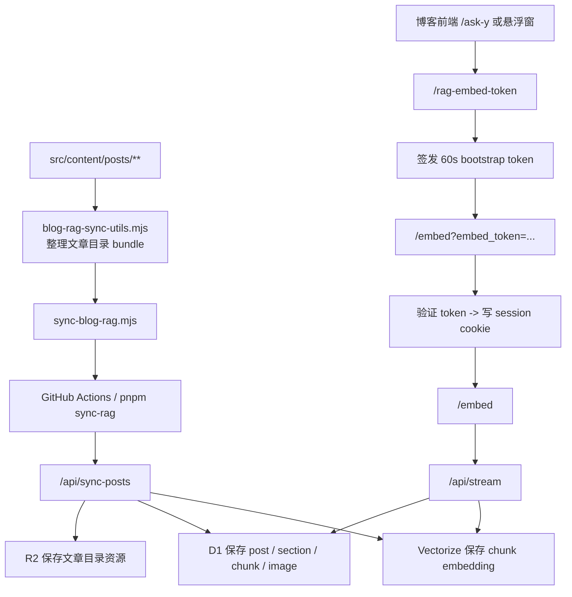
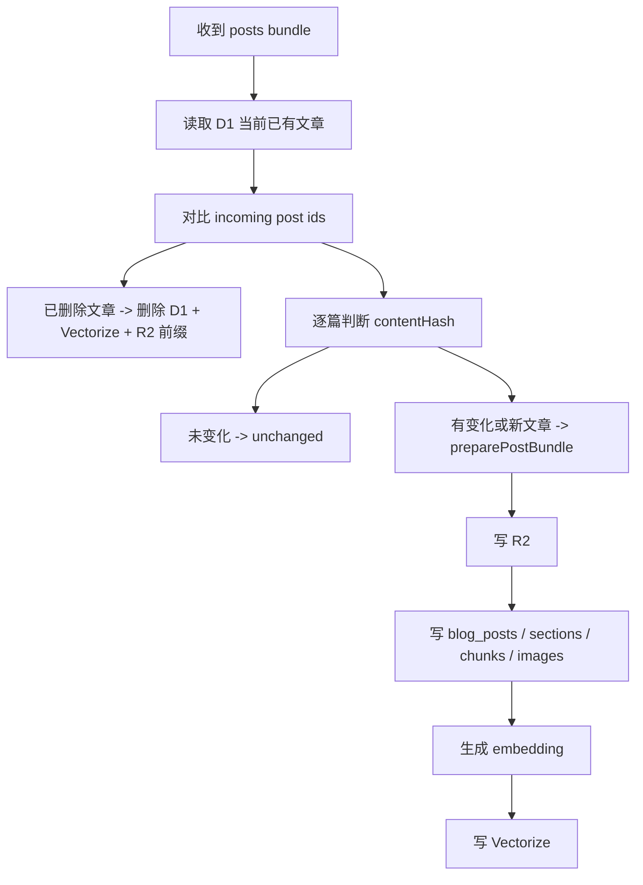
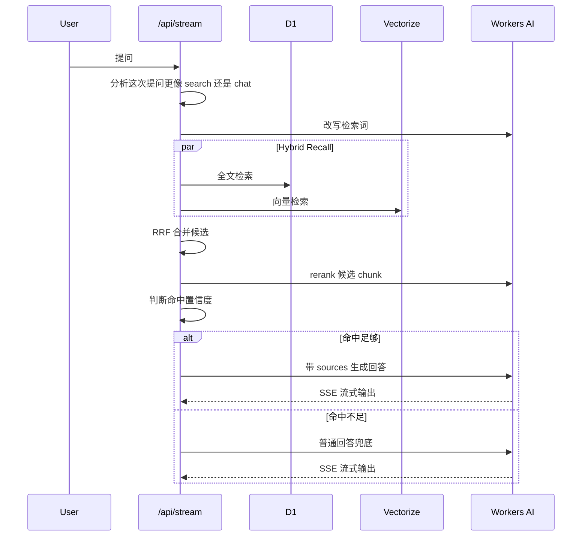
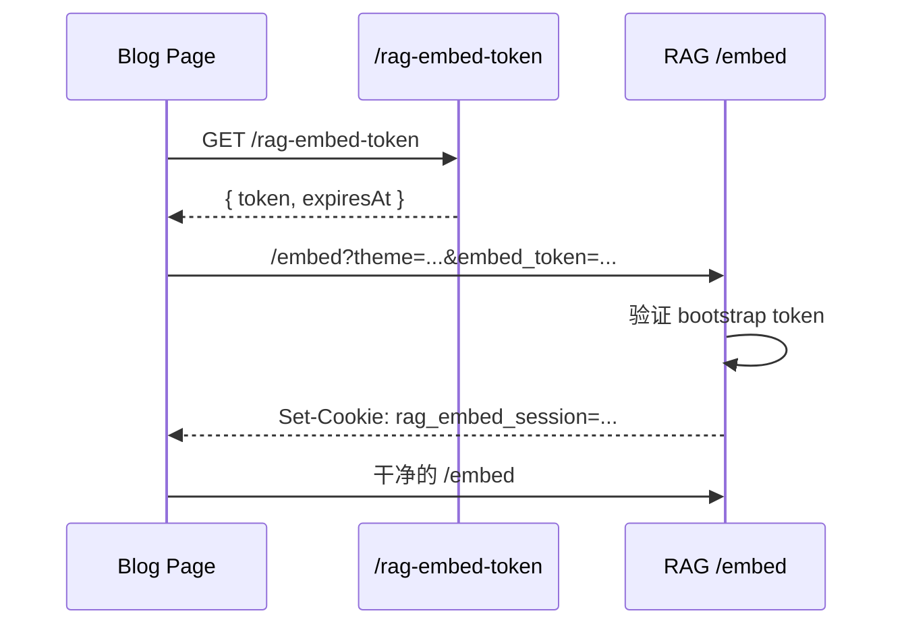
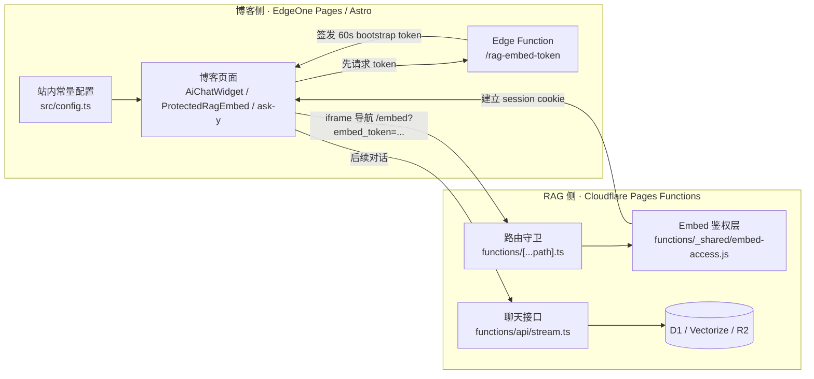

上一篇我已经把为什么会用 `cloudflare-rag`、为什么我觉得这条路适合个人博客这些事情写了一遍。  
这一篇就不再讲那些判断了，单独把实现细节拆开记录一下。

因为真正把它接进我这个博客里之后，我发现这里面其实是两件事叠在一起：

- 一件是 **博客内容怎么同步进 RAG**
- 另一件是 **RAG 聊天页面怎么安全地嵌回博客**

前者决定它能不能回答。  
后者决定它能不能只为我的博客服务，而不是顺手变成一个可以被任何人直接打开的公开聊天页。

这篇就专门写这两部分。

如果把这几篇连起来看，这篇算是中间那层。  
前一篇先讲我为什么会把 `Cloudflare-RAG` 接进博客：

- [用 Cloudflare-RAG 给我的博客补一个 AI 知识库](/posts/cloudflare-rag-mizuki-ai-kb/)

这一篇往下走到具体实现。  
再下一篇，则是服务已经接好以后，我怎么继续处理国内访问体感：

- [用阿里云 ESA 给 Cloudflare-RAG 聊天页做一次国内加速](/posts/aliyun-esa-cloudflare-rag-acceleration/)

## 先说一下我现在这套最终结构

我现在不是把 AI 直接写在博客前端里。

更准确一点的说法是：

- 博客前端还是 `Mizuki + Astro`
- 内容源还是 `src/content/posts/**`
- RAG 服务单独放在 `cloudflare-rag/`
- 博客通过 iframe 把受保护的 `/embed` 页面挂回来

整体链路大概是这样：



如果把职责拆开，其实就很清楚了。

博客这边主要负责两件事：

- 提供原始文章内容
- 给合法页面分发临时内嵌 token

RAG 这边主要也负责两件事：

- 把文章目录变成真正可检索的知识库
- 只允许持有合法 session 的 iframe 页面继续对话

## 我的博客侧，为什么不是只同步 Markdown 正文

如果只是做一个最简单的 demo，把 Markdown 正文扔给向量库当然也能跑。

但我自己的文章结构不是那种只有一篇 `index.md` 就结束的形式。  
很多文章目录下面本来就带着：

- `cover.png`
- 正文插图
- 局部截图
- SVG / JSON 这类辅助资源

所以我从一开始就不太想把它做成“只同步正文字符串”。

我最后采用的是目录级 bundle 方案。  
也就是说，`src/content/posts/<slug>/` 这个目录，本身就被我当成一个同步单元。

现在博客侧真正做这件事的是：

```text
scripts/blog-rag-sync-utils.mjs
scripts/sync-blog-rag.mjs
```

前者负责收集，后者负责发送。

## `blog-rag-sync-utils.mjs` 现在到底在打什么包

这个脚本主要做几件事。

第一步，扫描 `src/content/posts/**`。  
只要是 `.md` 文件，它都会去读 frontmatter。

第二步，先做文章可同步性判断。  
也就是这些不会进知识库：

- `draft: true`
- `encrypted: true`
- 有 `password`

这一层很重要。

因为我这里的 RAG 同步不是“发文章摘要”，而是把文章目录原始内容直接送去 Cloudflare。  
既然这样，草稿和受保护页面就应该在博客侧先挡掉，而不是等到了云端再考虑。

第三步，按文章目录收集文件。

它会把当前文章目录里所有文件都列出来，然后按文件类型分别处理：

- 文本类资源用 UTF-8 直接传
- 二进制资源走 base64

最后整理出来的 payload，大概长这样：

```json
{
  "id": "cloudflare-rag-mizuki-ai-kb/index.md",
  "slug": "cloudflare-rag-mizuki-ai-kb",
  "entryPath": "index.md",
  "url": "https://ynga.kingcola-icg.cn/posts/cloudflare-rag-mizuki-ai-kb/",
  "metadata": {
    "title": "用 Cloudflare-RAG 给我的博客补一个 AI 知识库",
    "description": "...",
    "published": "2026-05-13",
    "tags": ["Cloudflare", "RAG"]
  },
  "files": [
    {
      "path": "index.md",
      "contentType": "text/markdown; charset=utf-8",
      "encoding": "utf8"
    },
    {
      "path": "cover.png",
      "contentType": "image/png",
      "encoding": "base64"
    }
  ],
  "contentHash": "..."
}
```

这里的 `contentHash` 不是装饰用字段。  
它后面会直接影响 Cloudflare 侧要不要重建这一篇文章的索引。

所以我现在这套同步不是“每次全文重传再全文重建”。  
而是文章目录内容没变，就直接跳过。

## 为什么我要坚持做目录级 bundle

说到底，还是因为这样更符合博客本身的结构。

如果只同步正文，会立刻失去两类信息：

- 文章资源路径
- 图片和截图的存在关系

而我这个博客里偏教程、部署、排错的文章很多时候最关键的内容，恰恰不是一句纯文本总结。  
它可能是：

- 某个面板截图
- 某段配置前后的对比图
- 某张流程图
- 某个文件路径的上下文

目录级 bundle 至少给了我一个继续往下做的基础。  
后面不管是做图片索引、R2 资源代理，还是做 OCR 补充，前提都是博客侧先把目录原样带过去。

## 现在这条同步链路，已经收进 GitHub Actions 了

我后来不太想每次写完文章，还得自己再手动执行一遍同步脚本。

所以我把这一层也接进了 GitHub Actions。

现在实际在跑的是：

```text
.github/workflows/deploy.yml
```

它监听的路径很明确：

- `src/content/posts/**`
- `scripts/blog-rag-sync-utils.mjs`
- `scripts/sync-blog-rag.mjs`

也就是说，平时最常见的情况其实就是：

```text
本地改文章
  ↓
git add / commit / push
  ↓
GitHub Actions 触发
  ↓
pnpm sync-rag
  ↓
POST /api/sync-posts
```

如果只看使用体验，这件事现在已经被压缩得很轻了。

我平时就是正常写文章。  
知识库同步不再是第二套单独维护流程。

这里我自己挺在意的一点是，文章的真实来源还是仓库。  
知识库只是消费仓库，不是反过来成为另一套内容主库。

## `sync-blog-rag.mjs` 真正干了什么

这个脚本的角色其实很单纯。

它不会做复杂的 Markdown 解析。  
真正复杂的收集逻辑已经在 `blog-rag-sync-utils.mjs` 里了。

`sync-blog-rag.mjs` 做的主要是：

1. 读取博客配置里的默认同步地址和站点地址
2. 调用 `collectBlogRagPosts(...)`
3. 拿到所有文章 bundle
4. 用 `Authorization: Bearer ...` 发到 RAG 侧 `/api/sync-posts`

它同时也支持：

- `--dry-run`
- `--force`

所以现在如果我要做排查，也很方便。

比如先本地看一下它准备同步什么：

```bash
pnpm sync-rag:dry-run
```

如果我要强制让云端忽略 `contentHash` 重新构建：

```bash
pnpm sync-rag:force
```

这一层我没有把它做成很花哨的同步器。  
反而是尽量保持简单。

因为它本质上只是博客侧的“目录收集 + HTTP 推送”。

## Cloudflare-RAG 这边，真正接同步请求的是 `/api/sync-posts`

博客侧发过去以后，真正接住它的是：

```text
cloudflare-rag/functions/api/sync-posts.ts
```

这里首先会校验 `RAG_SYNC_TOKEN`。  
没有 token，或者 token 不对，直接就是 `401`。

然后它会解析 bundle payload。  
如果格式不对，或者 payload 为空，也会直接拒掉。

真正开始同步以后，逻辑大概是这样：



也就是说，它不是简单的 append。

现在这套同步里，至少有四种结果：

- `created`
- `updated`
- `unchanged`
- `deleted`

这一点挺重要。

因为如果你不处理删除，知识库很快就会变成一个和博客仓库不一致的历史堆积层。  
文章目录明明删掉了，但旧 chunk、旧图片、旧向量还都在，那后面检索出来的结果就会开始脏。

我现在这边的做法是比较直接的。  
只要一篇文章要重建，或者仓库里已经删掉了，它原来的：

- D1 数据
- Vectorize 向量
- R2 前缀资源

都会一起清掉。

## 真正的重活，其实都在 `postBundleIndexing.ts`

同步入口只是调度。

真正把一篇文章目录变成可检索知识库的是：

```text
cloudflare-rag/app/lib/postBundleIndexing.ts
```

这个文件在我现在这套实现里，基本算核心之一。

它大概做这些事：

1. 解包 bundle 文件
2. 找到 `entryPath`
3. 解析 frontmatter
4. 生成最终 post URL
5. 把 bundle 里的所有文件先写进 R2
6. 解析 Markdown section
7. 抽图片引用
8. 构建 section / chunk / image 三层索引记录
9. 给 chunk 生成 embedding
10. 把向量写进 Vectorize

这个过程里我自己比较看重两点。

### 第一，文件资源先落 R2

我现在不是等用户提问时再去动态找图片资源。

文章目录里的文件在 prepare 阶段就会先写进 `POST_ASSETS` 这个 R2 bucket。  
路径大概会整理成：

```text
posts/<slug>/<relative-path>
```

这样后面：

- 图片索引里能拿到稳定资源地址
- 前端可以通过 `/api/assets/posts/...` 去拿对应资源
- 旧文章重建时，也能按前缀整批删掉

这一步其实让整套东西更像一个“内容服务”，而不是单纯的文本向量库。

### 第二，不是只切 chunk，而是先分 section 再切 chunk

我没有直接对整篇文章无脑切块。

现在这边的思路是：

- 先按 Markdown heading 分 section
- 再对 section 文本做 chunk

这样后面每个 chunk 就天然带着这些上下文：

- 属于哪篇文章
- 属于哪一节
- heading 是什么
- anchor 是什么
- 有没有图片
- 有没有代码块
- 关联图片有哪些

这比“只知道这是一段文本”要有用得多。

尤其是教程类博客，用户问的经常不是一个抽象问题，而是：

- 某个步骤怎么做
- 某个配置项在哪一节
- 某张图前后那段说明是什么

section 这一层先分开，后面给模型喂上下文的时候也更稳。

## 我现在在 D1 里拆了四张核心表

为了让检索链路更清楚，我这边把博客知识库拆成了这几张表：

- `blog_posts`
- `blog_post_sections`
- `blog_post_chunks`
- `blog_post_images`

大概可以这么理解：

- `blog_posts` 负责文章级元数据
- `blog_post_sections` 负责“这一节讲了什么”
- `blog_post_chunks` 负责真正喂给检索和生成的最小文本单元
- `blog_post_images` 负责图片资源和图片上下文

这套拆法不是为了“看起来规范”。

而是因为我后面在检索阶段，确实需要这些粒度信息。

比如一段 chunk 检索出来以后，我还想知道：

- 它是不是图片相关
- 它是不是代码相关
- 它属于哪个 heading
- 它对应的图片资源 URL 是什么

如果前面不先拆开，后面这些都只能临时推断，准确性会差很多。

## 图片为什么也能跟着进知识库

我这边后面继续改得比较多的一块，就是图片。

因为博客文章不是纯文本。  
很多教程里真正重要的信息，其实在截图里。

现在 `postBundleIndexing.ts` 会先把文章里引用到的图片资源整理出来。  
除了基础字段：

- `relativePath`
- `alt`
- `title`
- `heading`
- `anchor`
- `surroundingText`

如果运行环境支持，还会额外对图片做一层 OCR / 图片转 Markdown 文本，把结果塞进 `ocrText`。

所以现在图片不只是“能显示”。  
它在知识库里也会变成一类可以参与匹配的辅助信息。

当然，我不想把这件事说得太夸张。

它现在还不是一个成熟的多模态知识库系统。  
更准确一点的说法应该是，我尽量把博客里原本只适合人眼看的内容，也往“可检索”推了一层。

对教程类内容来说，这一层其实已经很值了。

## `/api/assets/posts/**` 这一层，是给文章资源做代理的

因为图片和其他文件已经先落进了 R2，所以后面还要有一个读取入口。

这层就是：

```text
cloudflare-rag/functions/api/assets/[[path]].ts
```

它现在只允许访问 `posts/` 前缀下的对象键。  
而且会过滤掉不安全路径，比如 `.`、`..` 这种。

这一层做完以后，图片索引里就可以把资源地址统一写成：

```text
/api/assets/posts/<slug>/...
```

这样前端和聊天引用时，不需要直接暴露 R2 bucket 细节。  
资源路径也更可控。

## 真正回答问题的时候，我不是直接向量检索一下就结束

聊天入口现在主要在：

```text
cloudflare-rag/functions/api/stream.ts
```

我后来在这里补了不少自己的逻辑。  
不然它很容易退化成那种“查一下最相似段落，然后硬答”的普通 demo。

我现在这条问答链路，大概是这样：



如果只看代码，里面我比较看重的是这几层。

### 1. 先判断这次问题到底要不要走博客检索

不是所有问题都适合强行走 RAG。

比如用户只是：

- 问你是谁
- 问你能做什么
- 闲聊
- 问一个明显不依赖站内内容的泛问题

这种时候，强行去全文检索博客内容反而会把回答搞得很怪。

所以我先加了一层 retrieval preference 分析。  
先判断它更像：

- `search`
- 还是 `chat`

如果它更像普通对话，而且置信度已经够高，就直接走一般性回答。

### 2. 检索不是单路，而是全文检索和向量检索并行

我现在不会只跑向量检索。

因为博客这种内容有一个特点。  
有些问题特别依赖关键词、配置名、路径名、命令名，这时候全文检索就很重要。  
但有些问题又更像语义问法，这时候向量检索更有效。

所以我现在两条都跑：

- `searchFullText(...)`
- `queryVectorIndexWithPreferences(...)`

然后再用 `reciprocal rank fusion` 合并候选。

这一步的收益很现实。

它不一定让每个问题都更聪明，但会让很多博客场景下的命中更稳。  
尤其是部署、配置、报错这类问法，关键词和语义本来就都重要。

### 3. 候选命中了也不会直接拿去答，还要 rerank

RRF 合完以后，我还会再走一层 rerank。

用的是：

```text
@cf/baai/bge-reranker-base
```

这一步的作用很简单，就是把“看起来像候选”的东西再排一遍顺序。

这样后面真正喂给模型的，就不再是原始检索顺序，而是相关性更高的一组 chunk。

### 4. 我后来又补了“命中不够就别硬答”

这一层我自己很在意。

因为个人博客知识库最糟糕的情况，不是回答不了。  
而是明明没命中准，还装得像已经找到了站内依据。

所以我后面又加了一层 retrieval confidence 判断。  
如果：

- rerank 分数太低
- 候选过于模糊
- 单源命中太弱

那它就直接退回普通回答，而不是硬引用博客内容。

我宁可它老实一点，也不想它一本正经地胡说。

## 我为什么要单独做 `ask-y` 页面

真正把聊天挂回博客以后，我后来没有只保留右下角悬浮窗。

因为悬浮窗适合：

- 阅读时顺手问一句
- 快速追问某个点

但如果用户真的想把它当成一个围绕博客内容工作的助手来用，悬浮窗其实还是偏小。

所以我后来又单独做了：

```text
src/pages/ask-y.astro
```

这个页面本质上还是在嵌同一个受保护的 RAG embed。  
只是它给了一个更完整、更沉浸的对话入口。

现在前端这边大概就是两个入口并存：

- `AiChatWidget.astro` 负责悬浮聊天窗
- `ProtectedRagEmbed.astro` + `ask-y.astro` 负责完整对话页

## 真正麻烦的不是“嵌进去”，而是“不能被别人直接打开”

如果只是想把 RAG 页面塞进 iframe，其实事情不难。

真正让我后来继续往下补的，是这个问题：

> `https://rag.ynga.kingcola-icg.cn/embed` 不能变成一个任何人都能直接打开的公开聊天页。

因为对我来说，`cloudflare-rag` 现在已经不是独立站点。  
它是博客后面拆出去的一个知识库子服务。

也就是说，我真正想要的是：

- 博客正式域名可以正常内嵌
- 其他任意域名不能随便嵌
- 用户也不能直接访问 `rag` 域名单独聊天

这就是后面这套 token + session 的来源。

## 博客侧先发 token，不直接暴露最终 embed URL

我现在博客侧专门做了一个 Edge Function：

```text
edge-functions/rag-embed-token/index.js
edge-functions/rag-embed-token/proxy.js
```

它的职责很单纯。

不是直接返回聊天页面。  
而是先分发一个短时效 bootstrap token。

这个 token 现在是 HMAC 签名的，博客侧和 RAG 侧共享同一个：

```text
RAG_EMBED_SHARED_SECRET
```

协议字段基本固定成这样：

- `v`
- `iss`
- `aud`
- `kind`
- `origin`
- `path`
- `iat`
- `exp`

其中关键约束包括：

- `kind=bootstrap`
- `origin=https://ynga.kingcola-icg.cn`
- `path=/embed`
- TTL 是 60 秒

也就是说，这个 token 不是拿来长期用的。  
它只是第一次打开 iframe 时的引导凭证。

## 这个 token 也不是谁来请求都给

博客侧的 `/rag-embed-token` 不是公开 token 机。

现在它会检查：

- 当前请求 origin 是不是博客正式域名
- referer 是不是博客正式域名
- `sec-fetch-site` 是不是 `same-origin` / `none`

只有满足这些基本同源条件，它才会签发 token。

所以现在它的角色更像：

> 博客自己的页面，向博客自己的边缘函数申请一次性 embed 通行证。

这一层把很多乱七八糟的跨站请求先挡在博客侧了。

## 前端真正挂 iframe 的时候，是先取 token 再拼 URL

现在不管是悬浮窗还是 `ask-y` 页面，底层都不是静态写死：

```text
https://rag.ynga.kingcola-icg.cn/embed
```

它们现在的流程都是：



这一层现在主要体现在两个前端组件里：

- `src/components/control/AiChatWidget.astro`
- `src/components/rag/ProtectedRagEmbed.astro`

它们都是先请求 `BLOG_RAG_TOKEN_ENDPOINT`，拿到 token 以后，再把 iframe `src` 设置成：

```text
https://rag.ynga.kingcola-icg.cn/embed?theme=...&embed_token=...
```

这样做有一个很直接的好处。

最终真正可用的访问 URL，不会提前硬编码在静态 HTML 里。  
而是只有在博客页面实际打开、并且 token 请求成功时，iframe 才会真正导航过去。

## RAG 侧真正的入口控制，在 `functions/[[path]].ts`

Cloudflare-RAG 这边真正兜住路由的是：

```text
cloudflare-rag/functions/[[path]].ts
```

这里现在的策略很明确：

- `/` 直接 404
- `/embed` 走专门的授权逻辑
- 其他请求继续交给 Remix / Functions

所以现在 `rag` 这个域名从外面看，不再是一个完整公开站点。  
顶层直接访问就是没东西。

这其实正是我想要的结果。

## `/embed` 这一层，现在只认两种合法状态

真正的 embed 访问控制在：

```text
cloudflare-rag/functions/_shared/embed-access.js
```

这层现在只认两种情况：

### 情况一，已经带了合法 `rag_embed_session` cookie

如果用户之前已经通过合法 bootstrap token 建过会话，那后续直接放行到真正的 `/embed` 页面。

### 情况二，当前没 session，但 URL 上带了合法 `embed_token`

这时候它会：

1. 验证 token 签名
2. 检查 origin / path / kind / exp
3. 签发一个 `session` token
4. 写入 `rag_embed_session` cookie
5. 302 跳转到干净的 `/embed?theme=...`

这一步里 session cookie 现在的特征也比较明确：

- `HttpOnly`
- `Secure`
- `SameSite=Strict`
- 默认 `Max-Age=30min`

也就是说：

- bootstrap token 只活 60 秒
- 真正持续对话靠的是 30 分钟 session

这比一直把一次性 token 挂在 URL 上要干净得多。

## 为什么直接访问 `/embed` 还是 404

这部分我后来是故意这样收的。

现在 `/embed` 就算你已经拿到某个 rag 域名链接，也不是点开就能用。

因为它除了 token / session 之外，还会额外看请求形态：

- `referer` 必须是博客正式域名
- `sec-fetch-dest` 必须是 `iframe`
- `sec-fetch-site` 必须是 `same-site` 或 `same-origin`

所以它现在本质上是在要求：

> 这真的是从博客页面里嵌进来的 iframe 请求，而不是用户自己手动在地址栏里打开。

这就是为什么我现在可以做到：

- 博客里正常内嵌可用
- 单独把 rag 域名贴浏览器里打不开

## `/api/stream` 也不会再接受匿名请求

如果只把 `/embed` 收住，但 `/api/stream` 还能匿名访问，那其实还是没关严。

所以现在 `stream.ts` 入口一开始就会先走：

```text
authorizeEmbedStreamRequest(...)
```

没有合法 `rag_embed_session`，直接 `404`。  
有 session 才继续往下跑问答逻辑。

而且每次通过合法 session 请求成功时，它还会顺手续签一次 session cookie。  
所以这套会话不是死的，而是一个滑动续期的状态。

这个设计我觉得挺合适现在这个场景。

它既不会让 bootstrap token 长时间暴露在 URL 里，  
也不会让用户刚打开 iframe 没多久就突然掉授权。

## 为什么我还补了 `frame-ancestors`

就算有 token 和 session，我后来还是在 `/embed` HTML 响应上补了：

```text
Content-Security-Policy: frame-ancestors https://ynga.kingcola-icg.cn
```

这一层的意义很简单。

它不是解决“用户直接访问”的问题。  
而是解决“别的站点能不能把这个页面也嵌进去”的问题。

也就是说，就算某些情况下 URL 被别人知道了，  
浏览器层面也会继续限制只有博客正式域名能正常 iframe 这个页面。

这一层和 token/session 不是替代关系，而是叠加关系。

## 这套东西为什么要拆成博客边缘函数 + Cloudflare Functions 两层

如果只看实现，可能有人会觉得这套有点绕。

但我最后还是觉得拆成两层是对的。

博客侧 Edge Functions 负责：

- 站内同源校验
- 分发 bootstrap token
- 控制只有博客页面能申请 token

RAG 侧 Cloudflare Functions 负责：

- 验证 token
- 建立 session cookie
- 限制 `/embed` 和 `/api/stream`
- 附加 `frame-ancestors`

两边职责分开以后，整个边界会清楚很多。

如果只让 RAG 侧自己既做 token 分发、又做渲染、又做会话，  
博客这边就失去了对“谁有资格申请通行证”的第一道控制。

现在这样更像两段式访问：

- 博客先说，这个 iframe 是我自己页面发起的
- RAG 再说，好，我给它一段短会话

如果只看部署位置，我现在会把它理解成下面这张图。



如果按职责来拆，也很清楚：

- 博客侧主要负责“谁能申请 embed token”
- RAG 侧主要负责“拿着这个 token 的 iframe 能不能真的建立会话并继续聊天”

我自己比较喜欢这种分层。

因为它不会把所有判断都塞进同一个地方。  
博客先做一层同源控制，RAG 再做一层会话和 iframe 形态控制，边界会更稳。

## 现在这套东西，实际要配哪些 Secret 和环境变量

如果只看代码改动，这套链路确实不少。  
但真正上线时需要盯住的配置，反而没有想象中那么多。

我现在会把它分成三层来看：

- 博客仓库运行时常量
- 博客侧 Secret / CI 变量
- Cloudflare-RAG 侧 Secret / Pages 变量

### 1. 博客仓库里固定写死的常量

这些现在主要统一放在：

```text
src/config.ts
edge-functions/config.js
```

和这篇文章相关的核心常量主要是：

```ts
BLOG_RAG_SERVICE_ORIGIN = "https://rag.ynga.kingcola-icg.cn"
BLOG_RAG_SITE_ORIGIN = "https://ynga.kingcola-icg.cn"
BLOG_RAG_SYNC_ENDPOINT = "https://rag.ynga.kingcola-icg.cn/api/sync-posts"
BLOG_RAG_EMBED_URL = "https://rag.ynga.kingcola-icg.cn/embed"
BLOG_RAG_TOKEN_ENDPOINT = "/rag-embed-token"
BLOG_RAG_SITE_URL = "https://ynga.kingcola-icg.cn/"
```

以及博客边缘函数那边的：

```js
ALLOWED_BLOG_ORIGIN = "https://ynga.kingcola-icg.cn"
```

这一层不是 Secret。  
它更像是“当前正式站点和 RAG 服务的固定地址约定”。

如果后面换域名，优先改这一层。

### 2. 博客侧真正需要保密的值

博客这边运行时真正敏感、必须保密的，核心其实只有一个：

```text
RAG_EMBED_SHARED_SECRET
```

这个值会被博客侧 Edge Function 用来签发 bootstrap token。  
RAG 侧也必须配置成完全相同的值，否则：

- `/rag-embed-token` 能签出来
- 但 `cloudflare-rag` 验证不过
- 最后 iframe 会直接失败

所以这里最关键的不是“有没有配”，而是：

> 博客侧和 Cloudflare-RAG 侧必须是同一个值。

我是直接使用 PowerShell 先生成一段足够长的随机字符串：

```powershell
[Convert]::ToBase64String([Security.Cryptography.RandomNumberGenerator]::GetBytes(48))
```

然后把同一个值同时放到两边。

### 3. 博客仓库里和 GitHub Actions 相关的变量

如果你希望像我现在这样，文章 `git push` 以后自动触发同步，那 GitHub Actions 这一层还有几个值要配。

现在 `deploy.yml` 用到的是：

```text
BLOG_RAG_SYNC_TOKEN
BLOG_RAG_SYNC_ENDPOINT
BLOG_RAG_SITE_URL
```

其中：

- `BLOG_RAG_SYNC_TOKEN`  
  这是 GitHub Actions 里用来调用 `/api/sync-posts` 的 Bearer Token  
  建议放在 GitHub `Secrets`

- `BLOG_RAG_SYNC_ENDPOINT`  
  一般就是 `https://rag.ynga.kingcola-icg.cn/api/sync-posts`  
  放在 GitHub `Variables` 就够了

- `BLOG_RAG_SITE_URL`  
  一般就是 `https://ynga.kingcola-icg.cn/`  
  放在 GitHub `Variables`

如果本地要手动跑同步脚本，也可以直接在本地 `.env` 里配：

```env
BLOG_RAG_SYNC_TOKEN=your-sync-token
BLOG_RAG_SYNC_ENDPOINT=https://rag.ynga.kingcola-icg.cn/api/sync-posts
BLOG_RAG_SITE_URL=https://ynga.kingcola-icg.cn/
```

### 4. Cloudflare-RAG 侧必须有的 Secret

RAG 侧现在至少有两个 Secret 是必须的：

```text
RAG_SYNC_TOKEN
RAG_EMBED_SHARED_SECRET
```

它们各自负责的事不一样：

- `RAG_SYNC_TOKEN`  
  保护 `/api/sync-posts`  
  没有它，博客侧不能往知识库里推文章

- `RAG_EMBED_SHARED_SECRET`  
  验证博客侧签发的 bootstrap token，并生成 session cookie  
  没有它，受保护 iframe 根本建立不了合法会话

直接用 Wrangler 配：

```bash
pnpm exec wrangler pages secret put RAG_SYNC_TOKEN --project-name cloudflare-rag
pnpm exec wrangler pages secret put RAG_EMBED_SHARED_SECRET --project-name cloudflare-rag
```

### 5. Cloudflare-RAG 侧的 Pages 变量

除了 Secret 之外，`wrangler.toml` 这边现在还有几项关键变量：

```toml
BLOG_SITE_URL = "https://ynga.kingcola-icg.cn/"
BLOG_CORPUS_ID = "mizuki-blog"
EMBEDDING_MODEL = "@cf/baai/bge-m3"
CHAT_MODEL = "@cf/qwen/qwen3-30b-a3b-fp8"
RERANK_MODEL = "@cf/baai/bge-reranker-base"
```

这些里需要在意的是下面三项：

- `BLOG_SITE_URL`  
  这个值会被 RAG 侧拿来推导唯一允许的博客 origin  
  如果它写错，`/embed` 和 `/api/stream` 这层授权会直接出问题

- `EMBEDDING_MODEL`  
  它必须和当前 Vectorize index 的维度匹配  
  我现在这边默认还在用 `@cf/baai/bge-m3`

- `CHAT_MODEL` / `RERANK_MODEL`  
  这两个决定问答和重排阶段到底跑什么模型

### 6. 严格来说，它们还依赖几类 Cloudflare 绑定

这些不是 Secret，但没有的话服务也跑不起来：

- `AI`
- `VECTORIZE_INDEX`
- `DB`
- `rate_limiter`
- `POST_ASSETS`

可以简单理解成：

- `AI` 负责 embedding / rerank / chat
- `VECTORIZE_INDEX` 负责向量检索
- `DB` 是 D1
- `rate_limiter` 是 KV
- `POST_ASSETS` 是 R2

所以如果你后面要复刻这篇文章里的方案，我自己建议按这个顺序检查：

1. 域名常量是不是对的
2. 两边 `RAG_EMBED_SHARED_SECRET` 是不是同一个值
3. `RAG_SYNC_TOKEN` 和 GitHub Actions 里的 `BLOG_RAG_SYNC_TOKEN` 是不是配对的
4. `BLOG_SITE_URL` 是不是正式博客域名
5. D1 / Vectorize / R2 / KV / AI 这些绑定是不是都已经挂好

## 这套方案现在给我的感受

到这里其实就能看出来了。

我现在这套 `cloudflare-rag`，已经不是“拿来试试的聊天小玩具”了。  
它更像是我博客后面专门拆出去的一层知识库子服务。

它和我的博客现在不是松耦合的两个站点。  
而是：

- 内容源在博客
- 同步入口在博客
- 访问入口在博客
- 鉴权起点也在博客

Cloudflare-RAG 更像是后面的检索、索引和生成引擎。

这也是为什么我后面越来越确定，它应该被当成博客架构的一部分来看，而不是一个顺手挂上的第三方聊天框。

如果你只是想随便加一个公开 AI 页面，那这套做法确实有点重。  
但如果你想要的是：

- 保留自己的 Markdown 博客体系
- 自动同步文章目录
- 只允许指定正式域名内嵌
- 不希望 rag 域名被当成公开聊天站直接使用

那我觉得这一套就很值得。

至少到现在为止，我自己对这个方向还算满意。

后面有空会再继续往优化一下 RAG 检索回复的质量，回复更好的方向改进~

如果你是从这篇开始看的，前后两篇可以顺手一起看掉：

- [用 Cloudflare-RAG 给我的博客补一个 AI 知识库](/posts/cloudflare-rag-mizuki-ai-kb/)
- [用阿里云 ESA 给 Cloudflare-RAG 聊天页做一次国内加速](/posts/aliyun-esa-cloudflare-rag-acceleration/)
