这篇文章我想完整记录一下，我是怎么把自己基于 **[Mizuki](https://github.com/LyraVoid/Mizuki)** 搭建的博客，部署到 **[腾讯云 EdgeOne Pages](https://console.cloud.tencent.com/edgeone/pages)** 上的。  
整个过程并不复杂，但如果是第一次接触 [GitHub](https://github.com/) 自动部署、EdgeOne Pages、域名解析和 HTTPS 配置，中间还是有几个地方很容易卡住。

所以这篇我不打算只写一个“能跑起来”的简略版，而是按照我自己真实的操作顺序，把整个部署过程一步一步梳理清楚。  
如果你也准备把自己的 Mizuki 博客部署到 EdgeOne Pages，希望这篇能帮你少走一点弯路。

如果你还没有接触过这个主题，我建议可以先简单看一下 [Mizuki 官方文档](https://docs.mizuki.mysqil.com/guide/get-started/) 和对应的 [Mizuki GitHub 仓库](https://github.com/LyraVoid/Mizuki)，先对项目本身有一个整体认识，再来看这篇实操记录会更顺。

:::tip[这篇文章适合谁]
- 已经把 Mizuki 博客在本地跑起来的人
- 想把博客代码托管到 GitHub，再交给平台自动部署的人
- 想用腾讯云 EdgeOne Pages，并绑定自己的自定义域名的人
- 想让博客最终通过 `https://你的域名` 稳定访问的人
:::

## 先说一下这篇文章的最终结果

我最后实现的是这样一套流程：

1. 本地把 Mizuki 博客修改好
2. 提交并推送到 GitHub 仓库
3. 确保 GitHub Actions 全部通过
4. 在腾讯云 EdgeOne Pages 里导入这个 GitHub 仓库
5. 配置 `pnpm install` 和 `pnpm build`
6. 等待构建部署成功
7. 拿到临时预览地址做第一次访问确认
8. 绑定自己的自定义域名
9. 完成 TXT 验证、CNAME 解析和 HTTPS 证书申请
10. 最终通过正式域名稳定访问博客

如果你只想先看最后效果，我这边最终的正式访问地址就是：

```text
https://ynga.kingcola-icg.cn/
```

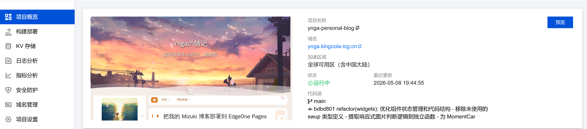

## 部署之前，我建议先确认这几件事

在真正点开 EdgeOne Pages 之前，我建议先把准备工作做完整。  
因为平台部署失败时，排查起来一定比本地麻烦。

### 1. 先保证本地项目能正常运行

至少要确认：

- 本地 `pnpm install` 正常
- 本地 `pnpm dev` 可以访问
- 本地 `pnpm astro check`可以通过
- 本地 `pnpm build` 可以构建成功

如果你本地都还没有跑通，就先不要急着上平台。  
平台的构建失败，本质上还是会回到你本地项目本身的问题上。

### 2. 一定要用 pnpm

Mizuki 项目是基于 `pnpm` 的，这一点非常重要。  
不管是你本地，还是后面在部署平台里，都建议统一使用 `pnpm`，不要混用 `npm`。

:::warning[不要把包管理器写错]
如果你在平台里填成 `npm install`，很容易在安装依赖阶段就直接失败。  
这类问题看起来像平台问题，实际上只是命令填错了。
:::

### 3. 先把代码上传到 GitHub，并确保检查全部通过

这一步我非常建议一定放在 EdgeOne Pages 之前。  
我的做法是先把 Mizuki 相关代码在本地调整好，然后上传到 GitHub，再看 GitHub Actions 是否全部通过。

换句话说，**先让 GitHub 侧的构建和检查稳定，再去接入腾讯云部署平台**，会顺很多。

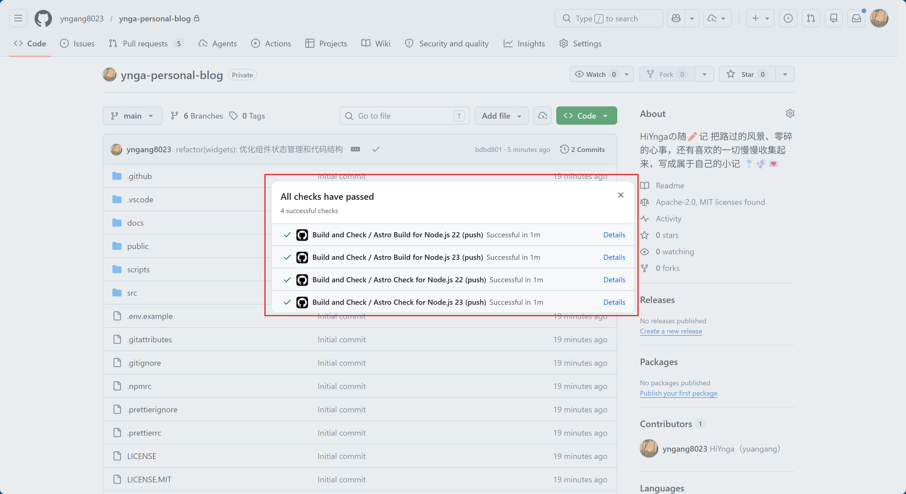

上图这个状态就很关键。  
当 GitHub 上的检查项全部通过之后，再去 EdgeOne Pages 里导入仓库，会更稳，也更省排查时间。

如果你还没有自己的代码仓库，也可以先到 [GitHub 官网](https://github.com/) 创建仓库，然后再把本地博客代码推上去。

## 第一步：到腾讯云控制台创建 EdgeOne Pages 项目

准备好 GitHub 仓库后，我进入 [腾讯云控制台](https://console.cloud.tencent.com/)，搜索 **EdgeOne**。  
然后在对应入口里点击：

**通过 Pages 快速部署网站**

接着创建项目，选择：

**通过导入 Git 仓库创建**

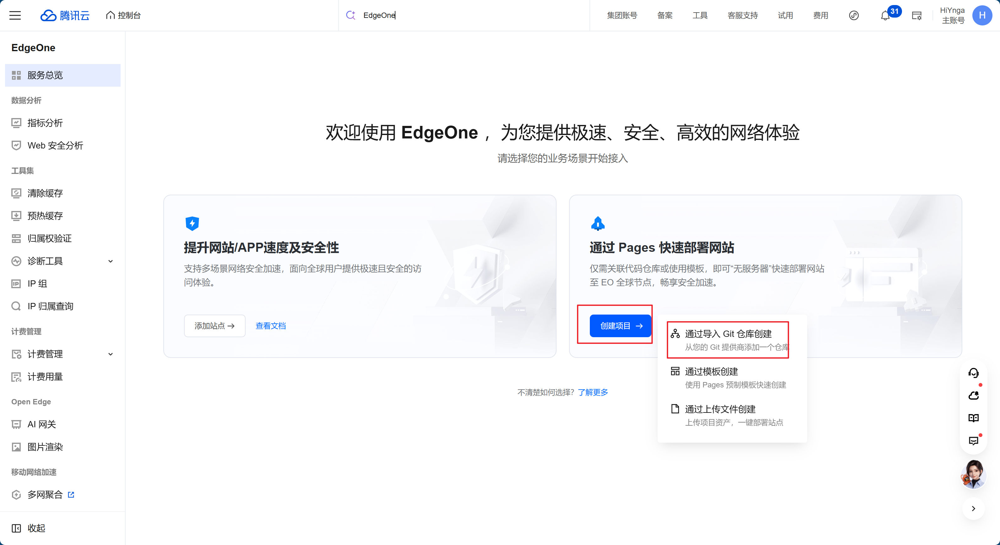

这一步的意义其实很明确：  
不是手动上传构建产物，而是把 GitHub 仓库直接接进来，让后续博客更新可以自动部署。

如果你想直接进入对应页面，也可以直接打开 [腾讯云 EdgeOne Pages 页面](https://console.cloud.tencent.com/edgeone/pages)。

## 第二步：选择 GitHub，并授权自己的仓库

接下来我在 Pages 的代码来源里选择 **GitHub**。  
第一次使用时，平台会要求你授权 GitHub 访问仓库。

授权完成之后，就可以在仓库列表里找到我刚刚上传代码的那个项目，然后选中它。

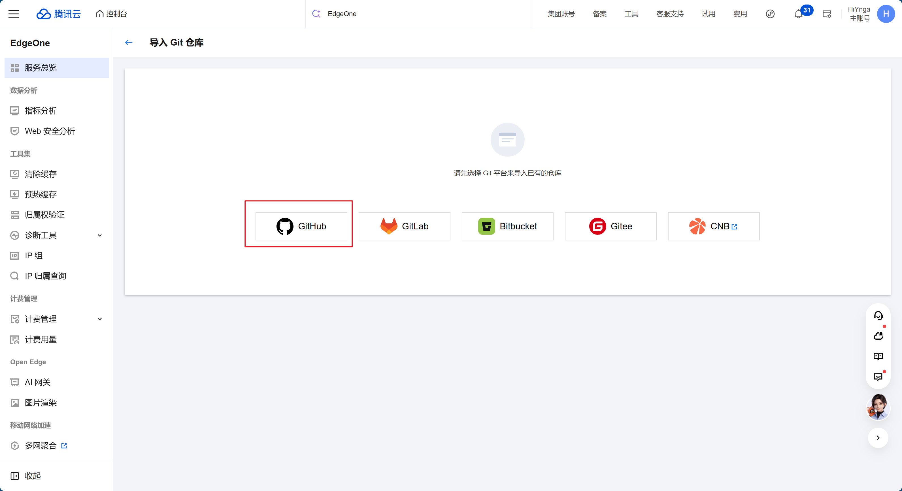

这里建议你注意两点：

1. 仓库不要选错
2. 分支要选正式在用的那个分支

我这里用的是：

- 仓库：`yngang8023/ynga-personal-blog`
- 生产分支：`main`

如果你后续也是把博客内容都推到 `main`，那这里就直接选 `main` 即可。  
后面 EdgeOne Pages 会持续监听这个分支，只要你再推送更新，它就会自动同步并重新构建部署。

如果你对 GitHub 的仓库、分支和提交流程还不太熟，建议先去 [GitHub 官网](https://github.com/) 简单熟悉一下基础操作，这样后面理解自动部署会更轻松。

## 第三步：配置项目参数和构建命令

这一步是整个部署过程中最关键的一段。  
很多“部署失败”的问题，其实就是这里填得不对。

我的实际配置是这样的：

- 框架预设：`Astro`
- 根目录：`./`
- 输出目录：`dist`
- 安装命令：`pnpm install`
- 构建命令：`pnpm build`

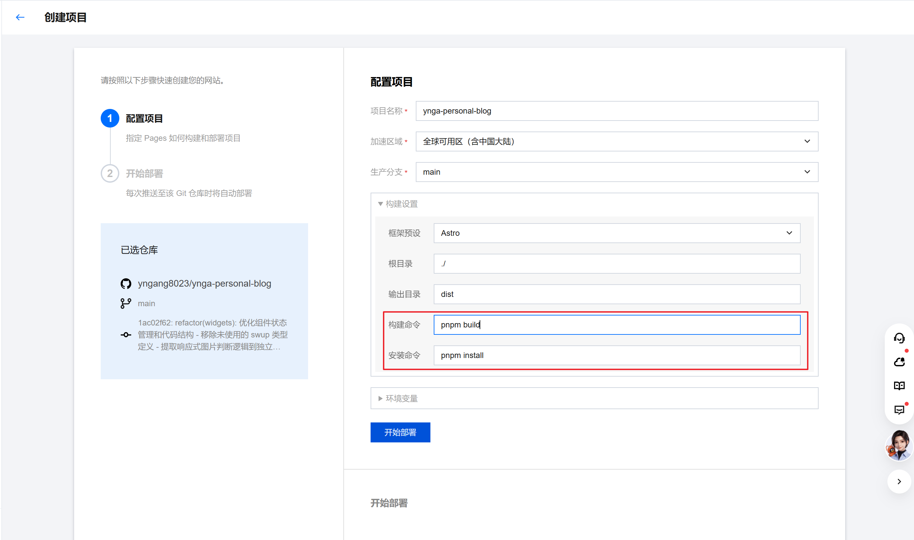

这里我特别想强调两点。

### 1. 框架预设选 Astro

既然 Mizuki 是基于 Astro 的，那框架预设这里就直接选 **Astro**。  
如果平台能识别对，后面很多默认值也会更省心。

### 2. 先看清加速区域和备案要求

这里还有一个很容易被忽略，但实际上非常关键的点，就是 **加速区域** 的选择。

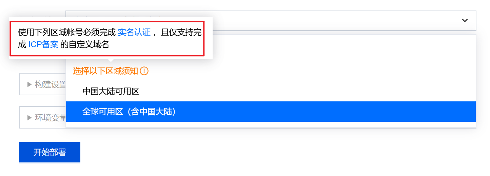

我自己在配置的时候也专门注意到了控制台这里的提示：  
如果你选择的是 **中国大陆可用区**，或者 **全球可用区（含中国大陆）**，那账号需要先完成实名认证，而且自定义域名通常也需要先完成 **ICP 备案**。

这件事并不是一个可有可无的小提醒，而是会直接影响你后面能不能顺利绑定正式域名。

结合腾讯云官方关于 EdgeOne 域名接入和使用限制的说明，我这里可以把它理解成：

- 如果你希望站点服务覆盖 **中国大陆可用区**
- 或者你选择的是 **全球可用区（含中国大陆）**
- 那么你后面要绑定的正式自定义域名，最好提前完成 ICP 备案

反过来说，如果你当前的域名 **还没有完成 ICP 备案**，那更稳妥的方式通常是选择：

- **全球可用区（不含中国大陆）**

也就是说，**未备案的域名并不是完全不能部署**，而是更适合走“全球可用区（不含中国大陆）”这条路径。  
这种情况下，站点一般仍然可以正常部署、正常访问，只是它不属于面向中国大陆可用区的那套接入方式。

如果你后面又想接入中国大陆访问加速，或者想把自定义域名稳定用于中国大陆相关场景，那还是建议把 ICP 备案提前做掉，会省很多后续折腾。

:::note[我对这一步的实际建议]
- 有备案域名：优先考虑 `全球可用区（含中国大陆）`(我自己选这个，有备案的域名)
- 没备案域名：优先考虑 `全球可用区（不含中国大陆）`
- 如果你主要就是想照顾国内访问体验，那最好提前把备案准备好
:::

这部分官方说明可以顺手参考：

- [腾讯云 EdgeOne 使用限制：域名备案与加速区域](https://www.tencentcloud.com/document/product/1145/63620)
- [腾讯云 EdgeOne 域名接入说明](https://www.tencentcloud.com/document/product/1145/46354)

### 3. 安装命令和构建命令不要混填

如果你的平台像 EdgeOne Pages 这样，已经把“安装命令”和“构建命令”分成两个输入框，那我更推荐你这样写：

```bash
# 安装命令
pnpm install
```

```bash
# 构建命令
pnpm build
```

而不是在构建命令里再写一遍：

```bash
pnpm i && pnpm build
```

后者不是不能用，虽然官方文档这样写，但那样通常等于重复安装依赖，会浪费构建时间。  
既然平台给了独立的安装步骤，那就分开写更清晰。

:::note[为什么输出目录一定是 dist]
Mizuki 基于 Astro，静态构建完成后的输出目录默认就是 `dist`。  
如果这里填错，比如写成 `build` 或其他目录，即使构建命令执行成功，最后也可能没有正确的发布结果。
:::

配置完成后，直接点击部署，等待平台开始第一次构建。

## 第四步：等待首次构建和部署完成

提交配置后，EdgeOne Pages 会自动去拉取 GitHub 仓库代码，然后执行安装和构建流程。  
第一次部署通常会稍微慢一点，这是正常的。

如果中间过程报错，我自己的建议是：

1. 先看构建日志
2. 判断是依赖安装报错，还是项目构建报错
3. 优先回到本地修正问题
4. 本地验证没问题后，再推送到 GitHub
5. EdgeOne Pages 一般会自动同步最新代码并重新构建

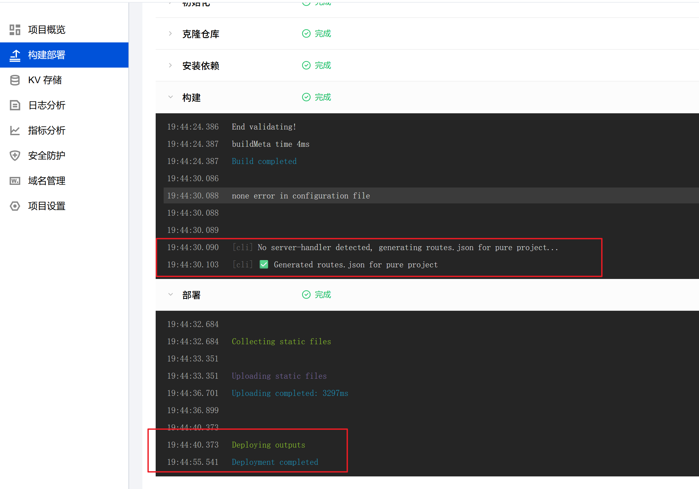

这一步其实很像一个闭环：

- 本地修
- 推 GitHub
- 看 GitHub Actions
- 再看 EdgeOne Pages 构建

如果你卡住了，也完全可以先问 AI 帮你排查本地项目问题，确认本地构建无误之后，再继续往 GitHub 和 EdgeOne 推进。

## 第五步：部署完成后，先用平台临时地址预览

构建和部署通过之后，项目状态会显示正常运行。  
这时候不要第一时间就去做域名绑定，我更建议先看一下平台给的临时预览站点。

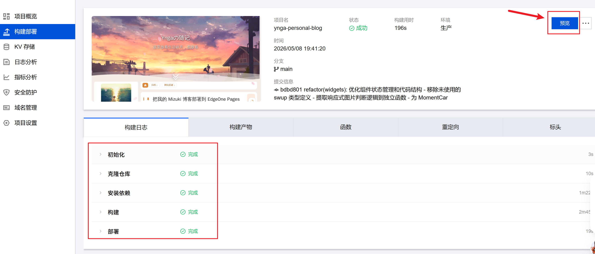

部署成功后，点击 **预览**，平台会弹出一个临时预览地址。

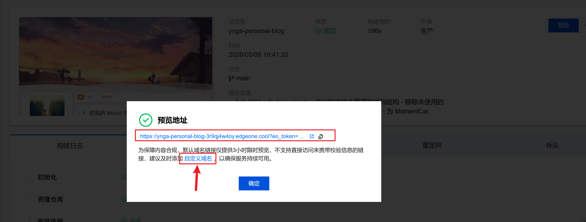

这个临时地址的价值很大，因为它可以帮你先确认：

- 首页能不能正常打开
- 博客文章页有没有问题
- 图片、样式、图标是否都加载正常
- 站点是不是确实已经成功部署

也就是说，在还没绑定正式域名之前，你先可以借助这个临时地址判断：  
问题究竟出在“站点部署本身”，还是后面“域名解析与证书配置”这部分。

## 为什么我还是建议绑定自己的自定义域名

平台临时地址适合测试，但如果你是要长期稳定使用博客，我还是建议绑定自己的正式域名。

原因很简单：

- 预览域名更适合测试，不适合长期对外使用
- 自定义域名更稳定，也更方便自己统一管理
- 后续做站点品牌、搜索收录、链接分享，也都更合适

所以我接下来的操作，就是从预览弹窗里继续进入 **自定义域名** 配置。

## 第六步：添加自定义域名

在 EdgeOne Pages 里点击 **自定义域名** 后，会进入域名管理页面。  
这里我做的操作是：点击 **添加自定义域名**。

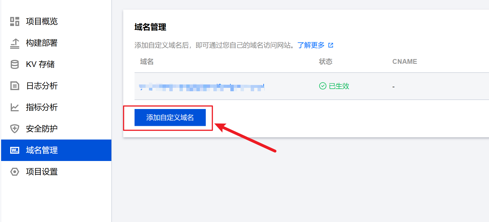

这里建议你直接填写你准备正式对外访问博客的那个域名。  
我自己用的是：

```text
ynga.kingcola-icg.cn
```

接下来会进入域名所有权验证和解析配置阶段。

## 第七步：先添加 TXT 记录，完成域名验证

这一步通常不是直接加 CNAME，而是要先做域名所有权验证。  
EdgeOne Pages 会给出一条需要添加的 **TXT 记录**。

然后你需要去你自己的域名服务商后台添加这条解析记录。  
我这里的域名服务商是 **阿里云**，所以我是到阿里云域名控制台里的 DNS 管理页面操作的。

这里的顺序建议是：

1. 先在域名服务商后台添加 EdgeOne Pages 给出的 TXT 记录
2. 保存后等待一会儿
3. 回到腾讯云 EdgeOne Pages 页面点击验证
4. 等待验证通过

这一步不要太着急。  
DNS 解析生效通常是需要一点时间的，如果刚加完记录立刻验证失败，也不一定是你填错了，有时候只是还没同步完成。

## 第八步：TXT 验证通过后，再添加 CNAME 记录

当域名所有权验证通过之后，EdgeOne Pages 通常还会要求你继续配置 **CNAME** 记录，让你的自定义域名真正指向 Pages 站点。

这里依然是回到你的域名服务商后台，在 DNS 管理里添加平台要求的那条 CNAME 记录。

完成之后，继续等待状态生效。  
只有当 CNAME 状态也正常之后，这个域名才算真正接入成功。

## 第九步：等解析状态全部正常，再申请 HTTPS

当 TXT 和 CNAME 都配置完成并且状态正常后，下一步就是开启 HTTPS。

我自己的处理方式是：

1. 进入 EdgeOne Pages 的 HTTPS 配置
2. 申请免费证书
3. 等待证书签发成功

这个过程通常也需要一点时间，不是点完立刻就好。  
所以这里建议耐心等一下，不用反复刷新操作太多次。

当域名解析和 HTTPS 都配置好之后，整个状态大概就会接近下面这样：

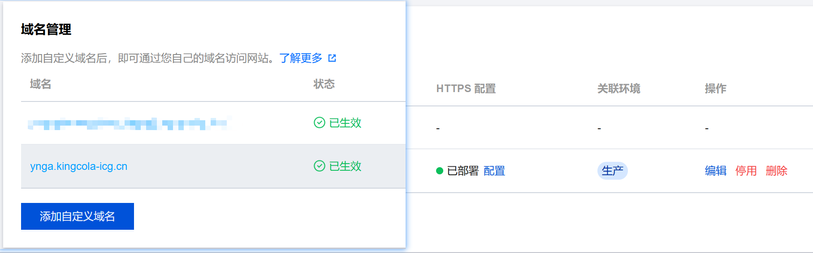

到这里，基本就可以认为整个“博客接入自定义域名并开启 HTTPS”的流程已经完整跑通了。

## 第十步：最终通过正式域名访问博客

当上面的步骤全部完成后，我就可以直接通过自己的正式域名访问博客了：

```text
https://ynga.kingcola-icg.cn/
```


看到这里能够稳定打开，其实整个部署流程就真正结束了。  
这时候 EdgeOne Pages 不再只是给我一个临时预览站点，而是已经变成了我博客的正式在线入口。

## 这套流程里，我自己觉得最容易踩坑的地方

为了让这篇文章不只是“步骤流水账”，我也顺手把我觉得最容易出问题的几个点记一下。

### 1. 代码还没稳定，就急着上部署平台

这是最容易浪费时间的。  
如果你本地还没调通，或者 GitHub Actions 还在报错，就先别急着导入 EdgeOne Pages。

更稳的顺序永远是：

1. 本地修好
2. 推 GitHub
3. GitHub Actions 全绿
4. 再上 EdgeOne Pages

### 2. 安装命令和构建命令写错

Mizuki 项目建议始终使用 `pnpm`。  
我这里最后验证稳定可用的配置就是：

```bash
pnpm install
pnpm build
```

### 3. 只看“构建成功”，不看页面实际效果

有时候构建成功，只能说明命令没报错，不代表页面一定完全正常。  
部署通过之后，我建议至少自己点开看看：

- 首页
- 一篇文章页
- 图片
- 字体
- 导航
- 移动端布局

### 4. 域名解析刚加完就反复操作

无论是 TXT 验证还是 CNAME 生效，DNS 都需要时间。  
很多时候不是你填错了，只是解析还没同步到位。

## 最后总结

如果让我用一句话总结这次部署体验，那就是：

**先把 Mizuki 项目在本地和 GitHub 上跑稳定，再交给 EdgeOne Pages 自动部署，整个过程会顺很多。**

我自己这次的完整顺序就是：

1. 本地修改好博客代码
2. 上传到 GitHub
3. 确保 GitHub Actions 全部通过
4. 在腾讯云 EdgeOne Pages 中导入仓库
5. 正确填写 `Astro / pnpm install / pnpm build / dist`
6. 等待构建部署完成
7. 先用临时预览地址确认站点没问题
8. 再绑定自定义域名
9. 配置 TXT、CNAME 和 HTTPS
10. 最终通过正式域名稳定访问

对我来说，这种方式最大的好处就是后续维护成本很低。  
以后只要我继续在本地写文章、改页面、推 GitHub，EdgeOne Pages 就会自动同步并重新部署，整个博客更新流程会非常顺。

如果你也准备把自己的 Mizuki 博客部署到 EdgeOne Pages，希望这篇实录式教程能正好帮到你。

## 相关链接整理

- [Mizuki 官方文档](https://docs.mizuki.mysqil.com/guide/get-started/)
- [Mizuki GitHub 仓库](https://github.com/LyraVoid/Mizuki)
- [GitHub 官网](https://github.com/)
- [腾讯云控制台](https://console.cloud.tencent.com/)
- [腾讯云 EdgeOne Pages 页面](https://console.cloud.tencent.com/edgeone/pages)

## 还有其他部署方式可以参考

最后再补充一句：  
这篇文章记录的是我自己使用 **EdgeOne Pages** 部署 Mizuki 博客的完整过程，但这并不是唯一方案。  
我这次之所以优先选择 EdgeOne Pages，一个很现实的原因就是：**对于国内访问来说，它通常会更快一些，整体打开体验也会更流畅。**

如果你更在意平台偏好、访问地区、操作习惯或者后续维护方式，其实还可以参考 Mizuki 官方文档里的其他部署方式，比如：

- Vercel
- Netlify
- GitHub Pages
- Cloudflare Pages
- 服务器部署
- Docker 部署

如果你想继续对比不同平台的部署体验，最建议直接从官方文档继续看：

- [Mizuki 开始使用与部署文档](https://docs.mizuki.mysqil.com/guide/get-started/)
