这篇文章不是一次性的演示页，而是后面长期维护的 Markdown 扩展语法示例集合。

以后博客里只要新增了新的 Markdown 渲染能力，我都会继续补到这里，方便自己统一查看，也方便后面排查“语法有没有正常渲染”“样式有没有被改坏”这类问题。

::::tip[这篇文章的用途]
这里更像一份持续更新的语法清单。

后面如果扩展了新的 Markdown 能力，比如新的卡片、新的提示块、新的内容组件或者别的自定义指令，都可以继续直接往下追加。
::::

## 通用网站卡片

适合在文章里直接展示一个普通网站链接，不只是纯文本链接，而是自动解析成卡片。

### 语法

```md
::site{url="https://waline.js.org/"}
```

### 效果

::site{url="https://waline.js.org/"}

如果写的是不带协议头的网址，也可以正常使用：

```md
::site{url="ynga.kingcola-icg.cn"}
```

::site{url="ynga.kingcola-icg.cn"}

如果目标站点本身没有做好 SEO 元数据，也可以手动覆盖卡片信息：

```md
::site{url="https://t.alcy.cc/" title="栗次元API-举个栗子" description="分享二次元、壁纸、原神、风景、横竖图等随机图片接口与图源服务。" accent="#7c5cff"}
```

目前网站卡片会优先解析这些信息：

- `og:site_name` / `og:title`
- `og:description` / `meta[name="description"]`
- `og:image` / `twitter:image`
- `apple-touch-icon` / `icon` / `shortcut icon`

如果这些都没有，会继续回退尝试：

- 页面 `<title>`
- `meta[name="keywords"]`
- 页面正文里的首张同源图片

### 效果

::site{url="https://t.alcy.cc/" title="栗次元API-举个栗子" description="分享二次元、壁纸、原神、风景、横竖图等随机图片接口与图源服务。" accent="#7c5cff"}

## GitHub 仓库卡片

适合在文章里展示 GitHub 项目仓库信息。

### 语法

```md
::github{repo="matsuzaka-yuki/Mizuki"}
```

### 效果

::github{repo="matsuzaka-yuki/Mizuki"}

## Gitee 仓库卡片

适合在文章里展示 Gitee 项目仓库信息，使用方式和 GitHub 卡片基本一致。

### 语法

```md
::gitee{repo="yngang/kingcola-icg-blog-web"}
```

### 效果

::gitee{repo="yngang/kingcola-icg-blog-web"}

## 图片画廊网格

适合把多张图片放在同一组里并排展示，效果和 [Firefly](https://github.com/CuteLeaf/Firefly) 的 `[grid] ... [/grid]` 基本一致并做了进一步的扩展实现。

::github{repo="CuteLeaf/Firefly"}

- 会根据包裹的图片数量自动布局，最多一行 4 张
- 也支持手动指定行数、列数，以及逐行布局
- 也支持按设备单独控制显示，比如只在桌面、只在平板、只在手机出现
- 同一排图片会自动做等高铺满
- 比例不一致时会用居中裁切补齐
- 图注会保持底部对齐
- 点击图片仍然可以走现有灯箱预览看完整图

### 基本语法

````md
[grid]


[/grid]
````

### 带图注示例

````md
[grid]


[/grid]
````

### 多行多列

如果你想明确控制每行列数，而不是完全交给系统自动判断，也可以直接指定列数。比如下面这个写法会固定按 2 列布局，图片多了以后就自动换成多行多列：

````md
[grid cols=2]


[/grid]
````

如果你希望进一步明确控制“总行数 + 总列数”，也可以写：

````md
[grid rows=2 cols=3]


[/grid]
````

如果你要的是更精确的逐行排版，也支持直接指定每一行几张图：

````md
[grid layout="4,3,2,1"]


[/grid]
````

如果你还想控制图片之间的间距，现在也支持：

````md
[grid cols=3 gap=lg]


[/grid]
````

其中 `gap=sm|md|lg` 可以控制网格间距。

现在也支持响应式列数控制和设备可见性控制，比如：

````md
[grid cols=4 desktop=true tablet=true tabletCols=3 mobile=true mobileCols=2]


[/grid]
````

这样桌面端会按 `4` 列显示，平板按 `3` 列显示，手机按 `2` 列显示。
如果某个设备不想显示，把对应开关设成 `false` 就行。

### 新增语法说明

- `desktop=true|false` 控制桌面端是否显示
- `tablet=true|false` 控制平板端是否显示
- `mobile=true|false` 控制手机端是否显示
- `tabletCols=1~3` 控制平板端每行列数
- `mobileCols=1~2` 控制手机端每行列数
- 这些显示开关如果不写，默认都按 `true` 处理，也就是桌面、平板、手机都会显示

一般建议这样理解：

- `cols` 是桌面端默认列数
- `tabletCols` 和 `mobileCols` 是单独给平板和手机准备的列数
- `layout="4,3,2,1"` 还是可以继续用来做逐行排版
- `desktop` / `tablet` / `mobile` 不写时，等价于都开启
- 如果某个设备开关是 `false`，那一整组网格在这个设备上就不会显示

### 效果

[grid]


[/grid]

[grid cols=2]


[/grid]

#### 仅桌面端显示

[grid cols=4 desktop=true tablet=false mobile=false]


[/grid]

#### 仅平板端显示

[grid cols=3 desktop=false tablet=true tabletCols=3 mobile=false]


[/grid]

#### 仅手机端显示

[grid cols=2 desktop=false tablet=false mobile=true mobileCols=2]


[/grid]

#### 两行每行三张图

[grid rows=2 cols=3 tablet=true mobile=false]


[/grid]

#### 更自由的逐行排版(桌面端)

[grid layout="4,3,2,1" tablet=false mobile=false]


[/grid]

#### 更自由的逐行排版(平板端)

[grid layout="3,2,1" desktop=false mobile=false]


[/grid]

#### 更自由的逐行排版(移动端)

[grid layout="2,1" tablet=false desktop=false]


[/grid]

#### 间距控制示例

[grid cols=3 gap=lg]


[/grid]

#### 响应式列数示例

[grid cols=4 mobile=2 tablet=3]


[/grid]

## 提示块

适合用来强调说明、补充提醒或者做信息分区。

### 语法

````md
::::note[说明]
这里是一段补充说明内容。
::::

::::warning[提醒]
这里是一段提醒内容。
::::
````

### 效果

::::note[说明]
这里是一段补充说明内容。
::::

::::warning[提醒]
这里是一段提醒内容。
::::

## 数学公式

适合在文章里写行内公式和块级公式。

## 行内公式 (Inline)

行内公式使用单个 `$` 符号包裹。

例如：欧拉公式 $e^{i\pi} + 1 = 0$ 是数学中最优美的公式之一。

质能方程 $E = mc^2$ 也是家喻户晓。

## 块级公式 (Block)

块级公式使用两个 `$$` 符号包裹，会居中显示。

$$
\int_{-\infty}^{\infty} e^{-x^2} dx = \sqrt{\pi}
$$

$$
x = \frac{-b \pm \sqrt{b^2 - 4ac}}{2a}
$$

## 复杂示例

### 矩阵 (Matrices)

$$
\begin{pmatrix}
a & b \\
c & d
\end{pmatrix}
\begin{pmatrix}
\alpha & \beta \\
\gamma & \delta
\end{pmatrix} =
\begin{pmatrix}
a\alpha + b\gamma & a\beta + b\delta \\
c\alpha + d\gamma & c\beta + d\delta
\end{pmatrix}
$$

### 极限与求和 (Limits and Sums)

$$
\sum_{n=1}^{\infty} \frac{1}{n^2} = \frac{\pi^2}{6}
$$

$$
\lim_{x \to 0} \frac{\sin x}{x} = 1
$$

### 麦克斯韦方程组 (Maxwell's Equations)

$$
\begin{aligned}
\nabla \cdot \mathbf{E} &= \frac{\rho}{\varepsilon_0} \\
\nabla \cdot \mathbf{B} &= 0 \\
\nabla \times \mathbf{E} &= -\frac{\partial \mathbf{B}}{\partial t} \\
\nabla \times \mathbf{B} &= \mu_0\mathbf{J} + \mu_0\varepsilon_0\frac{\partial \mathbf{E}}{\partial t}
\end{aligned}
$$

### 化学方程式 (Chemical Equations)

$$
\ce{CH4 + 2O2 -> CO2 + 2H2O}
$$

$$
\ce{2H2 + O2 ->[\text{点燃}] 2H2O}
$$

### 化学计量与单位 (Chemistry Units)

$$
\pu{1.23e4 J.mol^{-1}}
$$

$$
\pu{5.0e-3 mol.L^{-1}}
$$

### 分段函数 (Cases)

$$
f(x)=
\begin{cases}
x^2, & x \ge 0 \\
-x, & x < 0
\end{cases}
$$

### 盒装公式 (Boxed Formula)

$$
\boxed{E = mc^2}
$$

### 对齐推导 (Aligned Derivation)

$$
\begin{aligned}
\nabla \cdot (\nabla \times \bm{F}) &= 0 \\
\int_0^1 x^2 \,\d x &= \frac{1}{3}
\end{aligned}
$$

### 数组与增广矩阵 (Array / Augmented Matrix)

$$
\left[
\begin{array}{cc|c}
1 & 2 & 5 \\
3 & -1 & 4
\end{array}
\right]
$$

### 约分与删除线 (Cancel)

$$
\frac{\cancel{x}\,(x+1)}{\cancel{x}} = x+1
$$

### 宏命令示例 (Custom Macros)

$$
\begin{aligned}
x^\star &= \argmin_{x \in \RR} (x-2)^2 \\
&= 2
\end{aligned}
$$

$$
\E[X] = \sum_i x_i p_i,
\qquad
\Var(X) = \E[(X - \E[X])^2]
$$

$$
\Cov(X, Y) = \E[(X - \E[X])(Y - \E[Y])]
$$

$$
\norm{\bm{x}}_2 = \sqrt{\inner{\bm{x}}{\bm{x}}},
\qquad
\abs{x-2} \le \norm{\bm{x}}_2
$$

$$
\pd{f}{x} = 2x,
\qquad
\pdd{f}{x} = 2
$$

### 颜色与文本标签 (Color / Text)

$$
\color{#c71d23}{\text{Gitee Red}} \quad + \quad \color{#2563eb}{\text{Link Blue}}
$$

$$
\textcolor{#d97706}{\text{重点提示}}
\quad
\textcolor{#16a34a}{\text{通过}}
$$

### 公式编号与链接 (Tag / Link)

$$
\tag{Opt-1}
x^\star = \argmin_{x \in \RR} (x-2)^2
$$

$$
\href{https://katex.org/docs/supported.html}{\text{KaTeX Supported Functions}}
\quad\mid\quad
\url{https://katex.org/docs/options}
$$

### 受控 HTML 扩展 (Trusted HTML Extensions)

$$
\htmlClass{math-accent}{\boxed{\text{HTML Class Enabled}}}
$$

$$
\htmlClass{math-note}{\text{这是一个受控样式标签}}
$$

$$
\htmlStyle{color:var(--primary); background-color:var(--btn-plain-bg-hover); border-radius:.5rem; padding-inline:.45rem; padding-block:.12rem;}{\text{HTML Style Enabled}}
$$

### 论文风格排版示例 (Paper-style Layout)

$$
\begin{aligned}
\mathcal{L}(\theta)
&= \frac{1}{N}\sum_{i=1}^{N} \ell\bigl(f_\theta(x_i), y_i\bigr) + \lambda \norm{\theta}_2^2 \\
&\tag{1} \text{Empirical Risk with } \ell_2 \text{ Regularization}
\end{aligned}
$$

$$
\begin{aligned}
p(\boldsymbol{x} \mid y = k)
= \frac{1}{(2\pi)^{d/2}\operatorname{det}(\Sigma_k)^{1/2}}
\exp\left(
-\frac{1}{2}(\boldsymbol{x} - \mu_k)^{\mathsf{T}}
\Sigma_k^{-1}
(\boldsymbol{x} - \mu_k)
\right)
\end{aligned}
$$

## 论文风格统一排版

适合把常用公式整理成更像论文笔记的阅读结构，而不是只把一堆公式连续往下堆。

### 单行紧凑公式

````md
::::math-compact[单行紧凑公式]
$$
\operatorname{softmax}(\boldsymbol{z})_i
= \frac{e^{z_i}}{\sum_{j=1}^{K} e^{z_j}}
$$
::::
````

::::math-compact[单行紧凑公式]
$$
\operatorname{softmax}(\boldsymbol{z})_i
= \frac{e^{z_i}}{\sum_{j=1}^{K} e^{z_j}}
$$
::::

### 双栏并排公式

````md
::::math-cols[双栏并排公式]
:::math-col[损失函数]
$$
\mathcal{L}_{\mathrm{CE}}
= - \sum_{k=1}^{K} y_k \log \hat{y}_k
$$
:::

:::math-col[预测规则]
$$
\hat{y}
= \argmax_{k \in \set{1,\dots,K}} p_\theta(y=k \mid \boldsymbol{x})
$$
:::
::::
````

::::math-cols[双栏并排公式]
:::math-col[损失函数]
$$
\mathcal{L}_{\mathrm{CE}}
= - \sum_{k=1}^{K} y_k \log \hat{y}_k
$$
:::

:::math-col[预测规则]
$$
\hat{y}
= \argmax_{k \in \set{1,\dots,K}} p_\theta(y=k \mid \boldsymbol{x})
$$
:::
::::

### 带编号定理 / 引理风格

````md
::::theorem[一阶最优性条件]
若函数 $f$ 在 $x^\star$ 处可微，且 $x^\star$ 是无约束局部极小点，则

$$
\nabla f(x^\star) = 0
$$
::::

::::lemma[均值向量的线性性]
若随机向量 $\boldsymbol{X}, \boldsymbol{Y}$ 具有有限期望，且 $a,b \in \RR$，则

$$
\mathbb{E}[a\boldsymbol{X} + b\boldsymbol{Y}]
= a\,\mathbb{E}[\boldsymbol{X}] + b\,\mathbb{E}[\boldsymbol{Y}]
$$
::::
````

::::theorem[一阶最优性条件]
若函数 $f$ 在 $x^\star$ 处可微，且 $x^\star$ 是无约束局部极小点，则

$$
\nabla f(x^\star) = 0
$$
::::

::::lemma[均值向量的线性性]
若随机向量 $\boldsymbol{X}, \boldsymbol{Y}$ 具有有限期望，且 $a,b \in \RR$，则

$$
\mathbb{E}[a\boldsymbol{X} + b\boldsymbol{Y}]
= a\,\mathbb{E}[\boldsymbol{X}] + b\,\mathbb{E}[\boldsymbol{Y}]
$$
::::

### 长公式单行滚动

长公式保持单行展示并支持左右滚动，这样更接近论文排版，也不会被强行拆成多行。

````md
::::math-long[长公式单行滚动]
$$
\operatorname{KL}\!\bigl(q_\phi(\boldsymbol{z}\mid\boldsymbol{x}) \,\|\, p(\boldsymbol{z})\bigr)
- \mathbb{E}_{q_\phi(\boldsymbol{z}\mid\boldsymbol{x})}\!\left[\log p_\theta(\boldsymbol{x}\mid\boldsymbol{z})\right]
+ \lambda \sum_{l=1}^{L} \left\lVert \mathbf{W}^{(l)} \right\rVert_F^2
+ \beta \sum_{i=1}^{N}\sum_{k=1}^{K} y_{ik}\log\frac{y_{ik}}{\hat{y}_{ik}}
$$
::::
````

::::math-long[长公式单行滚动]
$$
\operatorname{KL}\!\bigl(q_\phi(\boldsymbol{z}\mid\boldsymbol{x}) \,\|\, p(\boldsymbol{z})\bigr)
- \mathbb{E}_{q_\phi(\boldsymbol{z}\mid\boldsymbol{x})}\!\left[\log p_\theta(\boldsymbol{x}\mid\boldsymbol{z})\right]
+ \lambda \sum_{l=1}^{L} \left\lVert \mathbf{W}^{(l)} \right\rVert_F^2
+ \beta \sum_{i=1}^{N}\sum_{k=1}^{K} y_{ik}\log\frac{y_{ik}}{\hat{y}_{ik}}
$$
::::

### 机器学习常用模板

$$
\operatorname{softmax}(\boldsymbol{z})_i = \frac{e^{z_i}}{\sum_{j=1}^{K} e^{z_j}},
\qquad
\hat{y} = \argmax_{k \in \set{1,\dots,K}} p_\theta(y=k \mid \boldsymbol{x})
$$

$$
\mathcal{L}_{\mathrm{CE}} =
- \sum_{k=1}^{K} y_k \log \hat{y}_k,
\qquad
\operatorname{KL}\bigl(p \,\|\, q\bigr) = \sum_x p(x)\log\frac{p(x)}{q(x)}
$$

### 线性代数常用模板

$$
\mathbf{A} \in \RR^{m \times n},
\qquad
\operatorname{rank}(\mathbf{A}) \le \min(m, n),
\qquad
\operatorname{tr}(\mathbf{A}^{\mathsf{T}} \mathbf{A}) = \norm{\mathbf{A}}_F^2
$$

$$
\operatorname{diag}(\lambda_1, \dots, \lambda_n) =
\begin{pmatrix}
\lambda_1 & 0 & \cdots & 0 \\
0 & \lambda_2 & \cdots & 0 \\
\vdots & \vdots & \ddots & \vdots \\
0 & 0 & \cdots & \lambda_n
\end{pmatrix}
$$

### 概率统计常用模板

$$
X_1, \dots, X_n \overset{\mathrm{i.i.d.}}{\sim} \mathcal{N}(\mu, \sigma^2),
\qquad
\bar{X} = \frac{1}{n}\sum_{i=1}^{n} X_i
$$

$$
\E[X \mid Y]
= \sum_x x \, p(x \mid Y),
\qquad
\Var(X) = \E[X^2] - \E[X]^2
$$

### 优化问题常用模板

$$
\begin{aligned}
\min_{\boldsymbol{x} \in \RR^n}\quad & f(\boldsymbol{x}) \\
\text{s.t.}\quad & g_i(\boldsymbol{x}) \le 0,\quad i=1,\dots,m \\
& h_j(\boldsymbol{x}) = 0,\quad j=1,\dots,p
\end{aligned}
$$

$$
\boldsymbol{x}^{(t+1)}
= \boldsymbol{x}^{(t)} - \eta_t \grad f\bigl(\boldsymbol{x}^{(t)}\bigr),
\qquad
\frac{\mathrm{d} f(x)}{\mathrm{d} x} \bigg\rvert_{x=x^\star} = 0
$$

更多 KaTeX 语法请参考 [KaTeX Supported Functions](https://katex.org/docs/supported.html)。

## Mermaid 图表

适合在文章里快速插入流程图之类的结构化内容。

现在这套 Mermaid 展示会优先渲染当前可见区域里的图表，正文里默认使用固定预览视口，长图不会再直接把整段文章撑裂。

- 支持拖拽查看
- 支持滚轮缩放
- 支持双击快速放大 / 重置
- 支持统一风格的全屏预览

## 流程图示例

流程图非常适合表示流程或算法步骤。


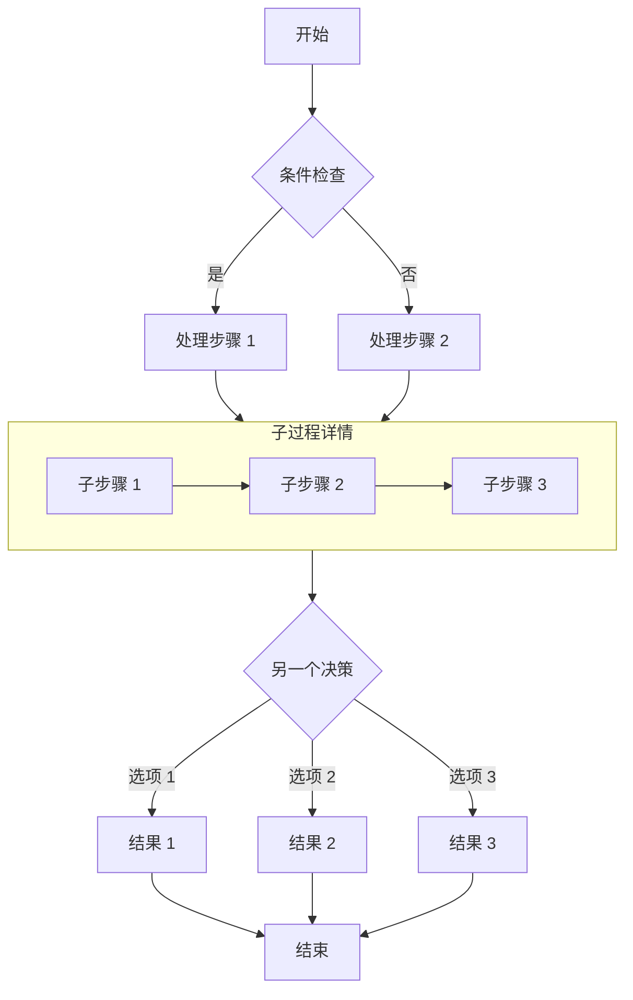

## 时序图示例

时序图显示对象之间随时间的交互。

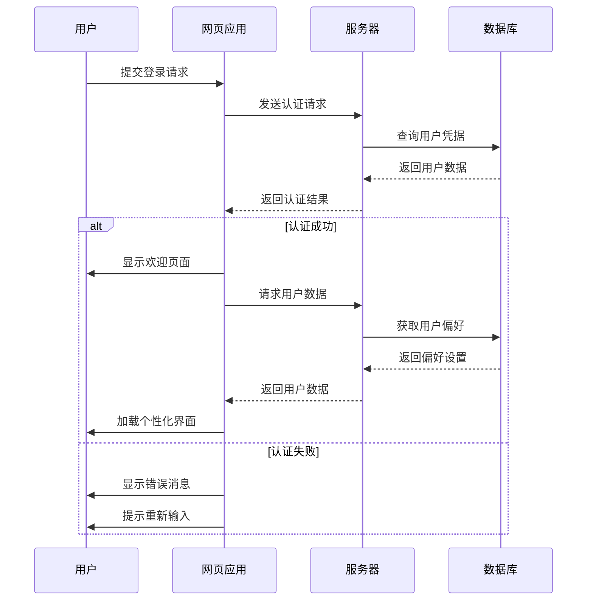

## 甘特图示例

甘特图非常适合显示项目进度和时间线。

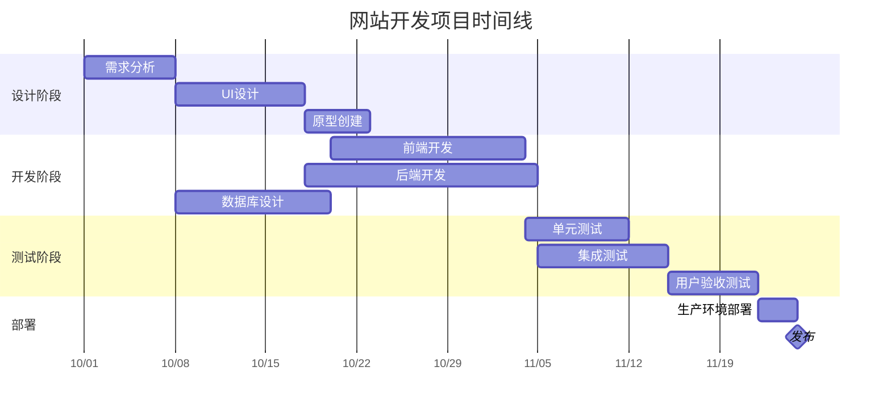

## 类图示例

类图显示系统的静态结构，包括类、属性、方法及其关系。

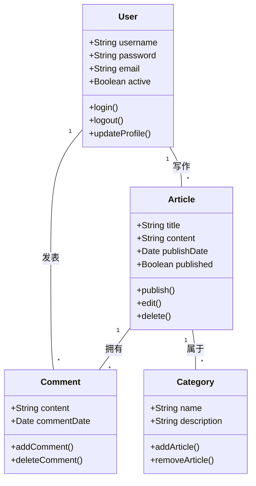

## 状态图示例

状态图显示对象在其生命周期中经历的状态序列。

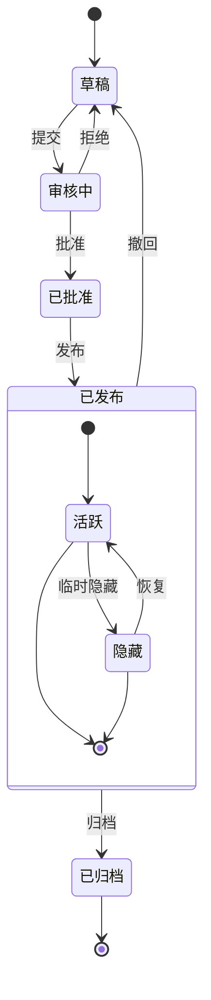

## 饼图示例

饼图非常适合显示比例和百分比数据。

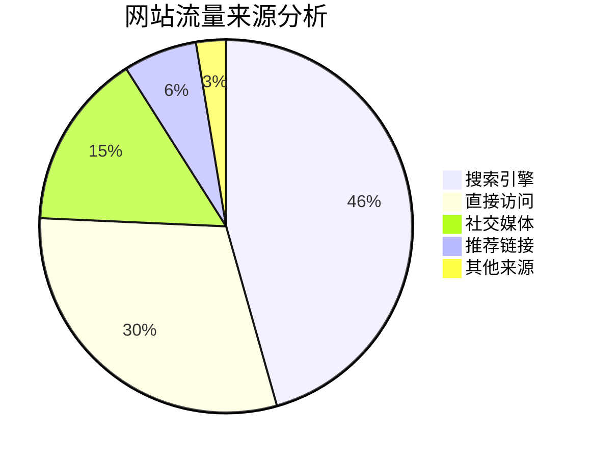

## ER 图示例

ER 图适合描述实体关系和字段结构。

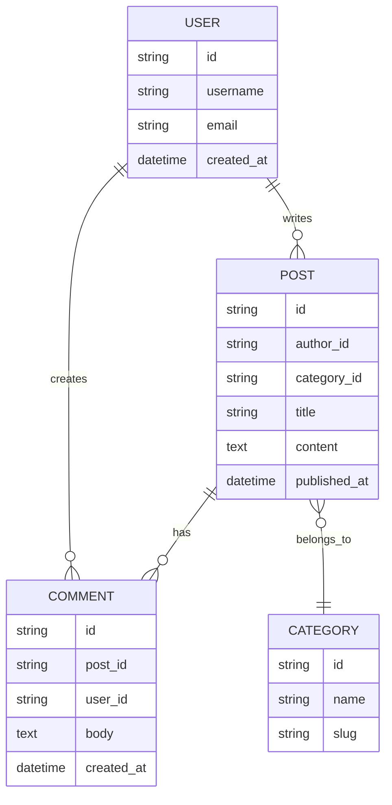

## 用户旅程图示例

Journey 图适合梳理一段用户体验流程。

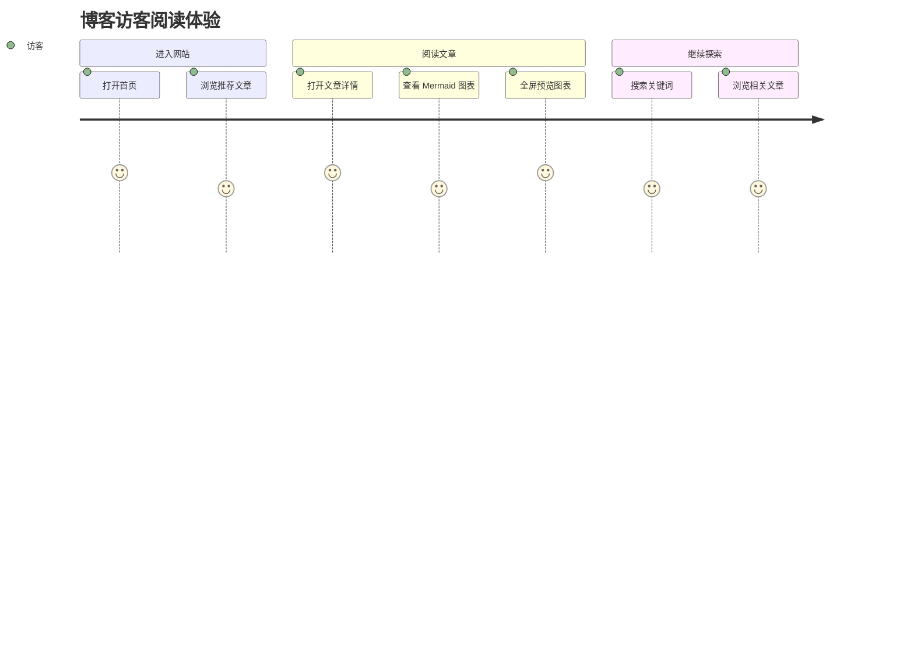

## Git Graph 示例

Git Graph 非常适合表示分支和提交关系。

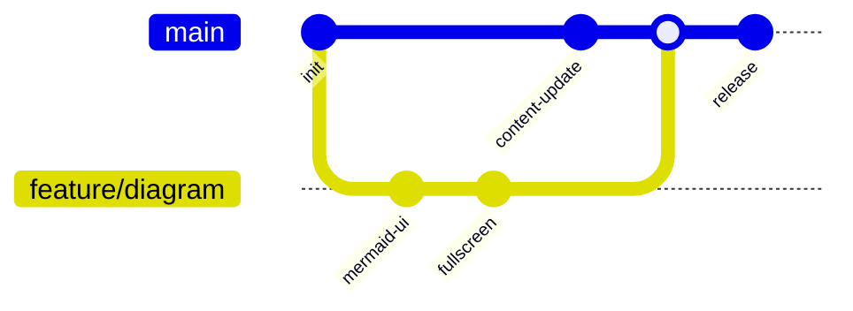


## PlantUML 图表

适合在文章里写时序图、活动图、状态图、组件图、部署图、ER 图这类工程文档常见图表。

这次博客里的接入方式直接沿用了 [Firefly](https://github.com/CuteLeaf/Firefly) 的实现：

::github{repo="CuteLeaf/Firefly"}

- Markdown 里使用 `plantuml` 代码块
- 也支持 `puml` 和 `uml` 作为代码块语言别名
- 构建阶段自动把源码编码成 PlantUML Server 的 SVG 地址
- 页面端根据明暗主题自动切换图源
- 同时支持缩放、拖拽、双击放大、全屏查看、显示源码、复制源码、在新标签打开原图和失败重试

### 最小语法

````md
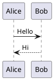

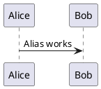

```uml
@startuml
Bob -> Alice: Alias works too
@enduml
```
````

### 最小效果


### 活动图示例

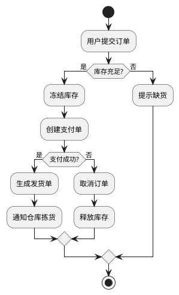

### 状态图示例

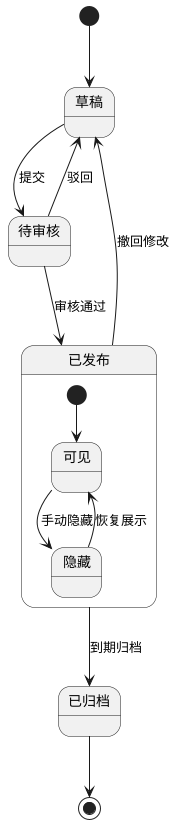

### 用例图示例

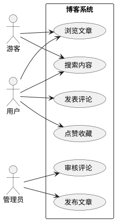

### 组件图示例

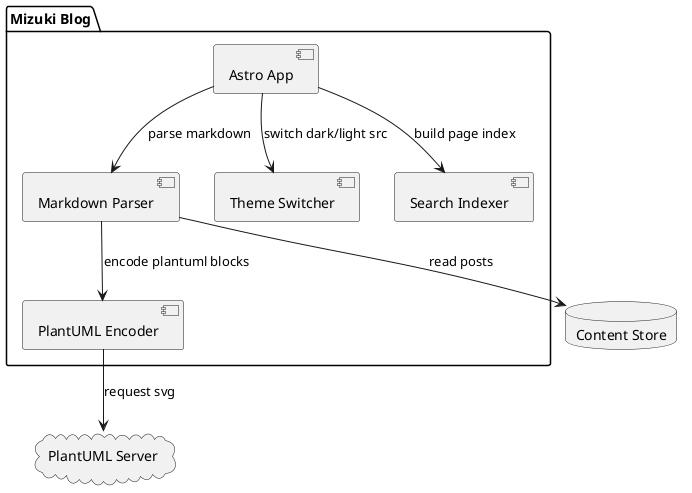

### 部署图示例

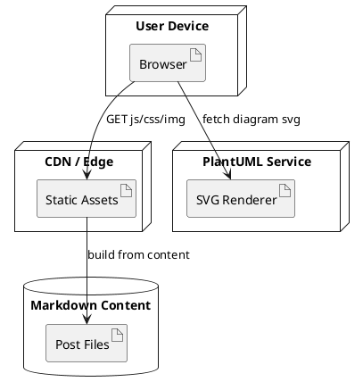

### ER 图示例

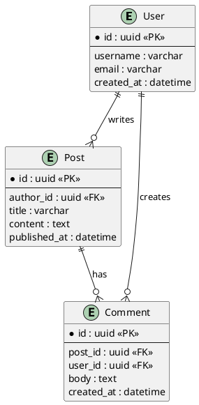

### 时序图示例

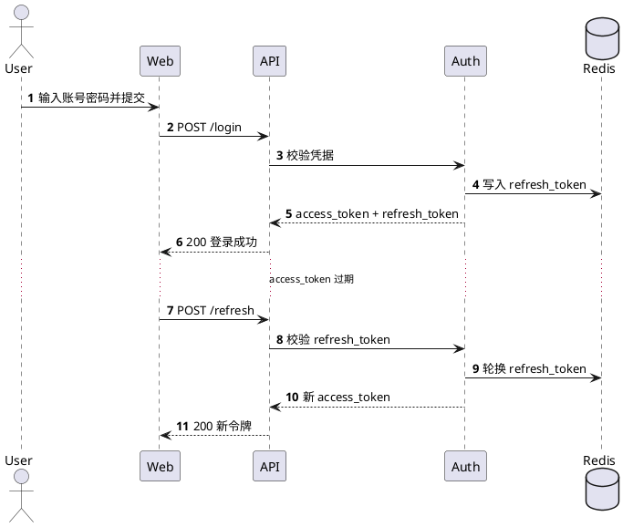

### C4 容器图示例

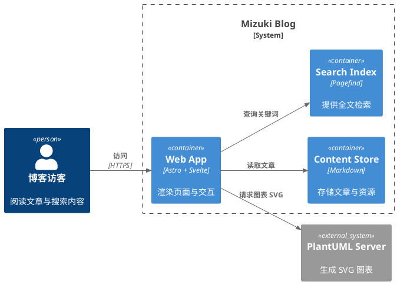

### 类图示例

```plantuml
@startuml
class Post {
  +id: UUID
  +title: string
  +publishedAt: Date
  +render(): HTML
}

class MarkdownRenderer {
  +parse(source: string): AST
  +render(ast: AST): HTML
}

class PlantUMLRenderer {
  +encode(source: string): string
  +buildUrl(encoded: string): string
}

MarkdownRenderer --> PlantUMLRenderer : render plantuml block
Post --> MarkdownRenderer : uses
@enduml
```

### 对象图示例

```plantuml
@startuml
object blog {
  title = "HiYnga Blog"
  theme = "Mizuki"
}

object post {
  slug = "website-make-demo"
  diagrams = 18
}

object renderer {
  server = "plantuml.com"
  darkTheme = "cyborg"
}

blog --> post : contains
post --> renderer : rendered by
@enduml
```

### 思维导图示例

```plantuml
@startmindmap
* 博客渲染能力
** Markdown 基础
*** 标题
*** 列表
*** 引用
** 增强语法
*** Mermaid
*** PlantUML
*** 数学公式
** 内容组件
*** GitHub 卡片
*** 网站卡片
*** 提示块
@endmindmap
```

### WBS 工作分解图示例

```plantuml
@startwbs
* 网站搭建
** 内容系统
*** 文章集合
*** 分类标签
*** SEO 元信息
** 渲染能力
*** Mermaid
*** PlantUML
*** KaTeX
** 页面体验
*** 响应式布局
*** 暗色模式
*** 图片灯箱
@endwbs
```

### Gantt 甘特图示例

```plantuml
@startgantt
title 博客功能迭代计划
[设计 Markdown 扩展] requires 3 days
[接入 PlantUML] requires 2 days
[接入 PlantUML] starts at [设计 Markdown 扩展]'s end
[补充示例文章] requires 2 days
[补充示例文章] starts at [接入 PlantUML]'s end
[回归检查] requires 1 days
[回归检查] starts at [补充示例文章]'s end
@endgantt
```

### JSON 数据图示例

```plantuml
@startjson
{
  "site": "HiYnga Blog",
  "post": {
    "slug": "website-make-demo",
    "category": "网站搭建",
    "tags": ["Markdown", "PlantUML", "Mizuki"]
  },
  "features": {
    "mermaid": true,
    "plantuml": true,
    "math": true
  }
}
@endjson
```

### YAML 数据图示例

```plantuml
@startyaml
site: HiYnga Blog
theme: Mizuki
post:
  slug: website-make-demo
  category: 网站搭建
  tags:
    - Markdown
    - PlantUML
    - Diagram
features:
  mermaid: true
  plantuml: true
  katex: true
@endyaml
```

### Salt 线框图示例

```plantuml
@startsalt
{+
  {^文章编辑器}
  Title    | "Markdown PlantUML 图表示例      "
  Slug     | "website-make-demo               "
  Category | ^网站搭建^
  [X] 发布
  [ ] 置顶
  .
  [保存草稿] | [发布文章]
}
@endsalt
```

### Timing 时序时间图示例

```plantuml
@startuml
concise "Author" as Author
concise "Renderer" as Renderer
concise "Browser" as Browser

Author is write
Renderer is idle
Browser is wait

@Author
0 is write
+20 is save
+20 is done

@Renderer
20 is parse
+20 is encode
+20 is done

@Browser
60 is fetch
+20 is display
@enduml
```

### Chart 图表示例

这个是 PlantUML 官方较新的能力。官方文档写的是从 `1.2026.0` 开始支持 `@startchart`。如果你后面看到这个示例没有渲染，通常是远端 PlantUML Server 版本没同步到对应能力。

```plantuml
@startchart
h-axis [Mon, Tue, Wed, Thu, Fri]
v-axis "Posts" 0 --> 10
bar "Published" [1, 2, 1, 3, 2] #3498db labels
line "Drafts" [2, 1, 3, 2, 4] #ff7f0e labels
legend right
@endchart
```

## Expressive Code 代码块

代码块如何使用 [Expressive Code](https://expressive-code.com/) 展示代码块。提供的示例基于官方文档，您可以参考以获取更多详细信息。

### 语法高亮

[语法高亮](https://expressive-code.com/key-features/syntax-highlighting/)

#### 常规语法高亮

```js
console.log('此代码有语法高亮!')
```

#### 渲染 ANSI 转义序列

```ansi
Standard ANSI colors:
- Dimmed:      Black  Red  Green  Yellow  Blue  Magenta  Cyan  White 
- Foreground:  Black  Red  Green  Yellow  Blue  Magenta  Cyan  White 
- Background:  Black  Red  Green  Yellow  Blue  Magenta  Cyan  White 
- Reversed:    Black  Red  Green  Yellow  Blue  Magenta  Cyan  White 

8-bit colors (showing colors 160-171 as an example):
- Dimmed:      160  161  162  163  164  165  166  167  168  169  170  171 
- Foreground:  160  161  162  163  164  165  166  167  168  169  170  171 
- Background:  160  161  162  163  164  165  166  167  168  169  170  171 
- Reversed:    160  161  162  163  164  165  166  167  168  169  170  171 

24-bit colors (full RGB):
- Dimmed:      ForestGreen - RGB(34,139,34)  RebeccaPurple - RGB(102,51,153) 
- Foreground:  ForestGreen - RGB(34,139,34)  RebeccaPurple - RGB(102,51,153) 
- Background:  ForestGreen - RGB(34,139,34)  RebeccaPurple - RGB(102,51,153) 
- Reversed:    ForestGreen - RGB(34,139,34)  RebeccaPurple - RGB(102,51,153) 

Font styles:
- Default
- Bold
- Dimmed
- Italic
- Underline
- Reversed
- Strikethrough
```

### 编辑器和终端框架

[编辑器和终端框架](https://expressive-code.com/key-features/frames/)

#### 代码编辑器框架

```js title="my-test-file.js"
console.log('标题属性示例')
```

---

```html
<!-- src/content/index.html -->
<div>文件名注释示例</div>
```

#### 终端框架

```bash
echo "此终端框架没有标题"
```

---

```powershell title="PowerShell 终端示例"
Write-Output "这个有标题!"
```

#### 覆盖框架类型

```sh frame="none"
echo "看，没有框架!"
```

---

```ps frame="code" title="PowerShell Profile.ps1"
# 如果不覆盖，这将是一个终端框架
function Watch-Tail { Get-Content -Tail 20 -Wait $args }
New-Alias tail Watch-Tail
```

### 文本和行标记

[文本和行标记](https://expressive-code.com/key-features/text-markers/)

#### 标记整行和行范围

```js {1, 4, 7-8}
// 第1行 - 通过行号定位
// 第2行
// 第3行
// 第4行 - 通过行号定位
// 第5行
// 第6行
// 第7行 - 通过范围 "7-8" 定位
// 第8行 - 通过范围 "7-8" 定位
```

#### 选择行标记类型 (mark, ins, del)

```js title="line-markers.js" del={2} ins={3-4} {6}
function demo() {
  console.log('此行标记为已删除')
  // 此行和下一行标记为已插入
  console.log('这是第二个插入行')

  return '此行使用中性默认标记类型'
}
```

#### 为行标记添加标签

```jsx {"1":5} del={"2":7-8} ins={"3":10-12}
// labeled-line-markers.jsx
<button
  role="button"
  {...props}
  value={value}
  className={buttonClassName}
  disabled={disabled}
  active={active}
>
  {children &&
    !active &&
    (typeof children === 'string' ? <span>{children}</span> : children)}
</button>
```

#### 在单独行上添加长标签

```jsx {"1. Provide the value prop here:":5-6} del={"2. Remove the disabled and active states:":8-10} ins={"3. Add this to render the children inside the button:":12-15}
// labeled-line-markers.jsx
<button
  role="button"
  {...props}

  value={value}
  className={buttonClassName}

  disabled={disabled}
  active={active}
>

  {children &&
    !active &&
    (typeof children === 'string' ? <span>{children}</span> : children)}
</button>
```

#### 使用类似 diff 的语法

```diff
+此行将标记为已插入
-此行将标记为已删除
这是常规行
```

---

```diff
--- a/README.md
+++ b/README.md
@@ -1,3 +1,4 @@
+this is an actual diff file
-all contents will remain unmodified
 no whitespace will be removed either
```

#### 结合语法高亮和类似 diff 的语法

```diff lang="js"
  function thisIsJavaScript() {
    // 整个块都会以 JavaScript 高亮显示，
    // 并且我们仍然可以为其添加 diff 标记！
-   console.log('要删除的旧代码')
+   console.log('新的闪亮代码！')
  }
```

#### 标记行内的单独文本

```js "given text"
function demo() {
  // 标记行内的任何给定文本
  return '支持给定文本的多个匹配项';
}
```

#### 正则表达式

```ts /ye[sp]/
console.log('单词 yes 和 yep 将被标记。')
```

#### 转义正斜杠

```sh /\/ho.*\//
echo "Test" > /home/test.txt
```

#### 选择内联标记类型 (mark, ins, del)

```js "return true;" ins="inserted" del="deleted"
function demo() {
  console.log('这些是插入和删除的标记类型');
  // return 语句使用默认标记类型
  return true;
}
```

### 自动换行

[自动换行](https://expressive-code.com/key-features/word-wrap/)

#### 为每个块配置自动换行

```js wrap
// 启用换行的示例
function getLongString() {
  return '这是一个非常长的字符串，除非容器极宽，否则很可能无法适应可用空间'
}
```

---

```js wrap=false
// wrap=false 的示例
function getLongString() {
  return '这是一个非常长的字符串，除非容器极宽，否则很可能无法适应可用空间'
}
```

#### 配置换行的缩进

```js wrap preserveIndent
// preserveIndent 示例（默认启用）
function getLongString() {
  return '这是一个非常长的字符串，除非容器极宽，否则很可能无法适应可用空间'
}
```

---

```js wrap preserveIndent=false
// preserveIndent=false 的示例
function getLongString() {
  return '这是一个非常长的字符串，除非容器极宽，否则很可能无法适应可用空间'
}
```

## 可折叠部分

[可折叠部分](https://expressive-code.com/plugins/collapsible-sections/)

```js collapse={1-5, 12-14, 21-24}
// 所有这些样板设置代码将被折叠
import { someBoilerplateEngine } from '@example/some-boilerplate'
import { evenMoreBoilerplate } from '@example/even-more-boilerplate'

const engine = someBoilerplateEngine(evenMoreBoilerplate())

// 这部分代码默认可见
engine.doSomething(1, 2, 3, calcFn)

function calcFn() {
  // 您可以有多个折叠部分
  const a = 1
  const b = 2
  const c = a + b

  // 这将保持可见
  console.log(`计算结果: ${a} + ${b} = ${c}`)
  return c
}

// 直到块末尾的所有代码将再次被折叠
engine.closeConnection()
engine.freeMemory()
engine.shutdown({ reason: '示例样板代码结束' })
```

## 行号

[行号](https://expressive-code.com/plugins/line-numbers/)

### 为每个块显示行号

```js showLineNumbers
// 此代码块将显示行号
console.log('来自第2行的问候!')
console.log('我在第3行')
```

---

```js showLineNumbers=false
// 此块禁用行号
console.log('你好?')
console.log('抱歉，你知道我在第几行吗?')
```

### 更改起始行号

```js showLineNumbers startLineNumber=5
console.log('来自第5行的问候!')
console.log('我在第6行')
```


## 后续补充

这篇文章后面会继续追加新的 Markdown 扩展示例。

如果哪次改动把现有渲染效果改坏了，这篇文章也可以顺手拿来当回归检查页用。
